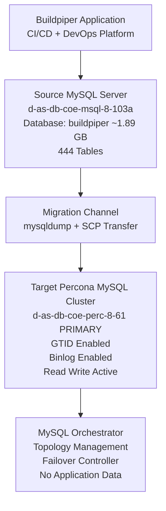

# DATABASE MIGRATION DOCUMENT

## Buildpiper Database Migration to Percona MySQL Primary (GTID-Based Cluster)

---

## 1. Document Overview

This document describes the planned migration of the **Buildpiper database (~1.89 GB)** from the source MySQL server (`d-as-db-coe-msql-8-103a`) into the **Percona MySQL primary node (`d-as-db-coe-perc-8-61`)**, which is part of a GTID-enabled replication cluster managed via **MySQL Orchestrator**.

The purpose of this migration is to ensure centralized, highly available database management under Percona Server with Orchestrator-based failover handling.

---

## 2. Source & Target Systems

### 2.1 Source Server (Buildpiper DB Host)

* Host: `d-as-db-coe-msql-8-103a`
* Role: Standalone MySQL server (Buildpiper database host)
* DB Engine: MySQL 8.x compatible
* Key DB: `buildpiper` (~1.89 GB)
* Other DBs:

  * `semaphore`
  * `test_db`
* Tables: 444 tables in Buildpiper schema

---

### 2.2 Target Server (Percona Primary Node)

* Host: `d-as-db-coe-perc-8-61`
* Role: Primary node in Percona GTID cluster
* Engine: Percona Server for MySQL 8.0.45
* Status:

  * `read_only = OFF`
  * `super_read_only = OFF`
  * `log_bin = ON`
  * `gtid_mode = ON`
* Replication: GTID-based (Orchestrator managed)

---

## 3. Orchestrator Setup (Important Context)

Orchestrator is already managing replication topology.

### Orchestrator Configuration:

File:
`/etc/orchestrator.conf.json`

Key credentials:

* Topology User: `orchestrator`
* Topology Password: `Orch@123`
* UI User: `admin / Opstree@123`
* Backend DB:

  * DB: `orchestrator`
  * User: `orchestrator_srv`

### Role of Orchestrator:

* Manages MySQL replication topology
* Detects master/slave changes
* Handles failover automation
* Does NOT store application data

👉 **Important:** Orchestrator is NOT used for migration itself.

---

## 4. Current MySQL Topology State

From Percona master:

### Master Status:

```sql
SHOW MASTER STATUS;
```

* Binary Log: `binlog.000006`
* Position: `95492`
* GTID Enabled: YES
* GTID Set:
  `9dd27528-4d4f-11f1-aa43-bc2411f5285e:1-8197`

---

### Replication Users:

* `repl` → replication user
* `orchestrator` → topology management
* `slave` → replica access

---

### Active Connections:

* Orchestrator monitoring connections active
* Semaphore application connections active
* Replication stream active (GTID dump thread)

---

## 5. Buildpiper Database Overview

### Size:

```sql
~1.89 GB
```

### Structure:

* 444 tables
* Django-based schema (clearly visible)
* Key modules:

  * CI/CD pipelines
  * Kubernetes deployment metadata
  * Environment management
  * ConfigMaps & Secrets
  * Git integration
  * Release pipelines
  * Monitoring & metrics

### Critical Nature:

Buildpiper is:

* A **production-grade DevOps platform**
* Contains deployment state, pipeline metadata, secrets, and environment config

👉 Downtime-sensitive workload

---

## 6. Migration Strategy

### 6.1 Chosen Method: Logical Dump + GTID-safe Import

We will use:

### Step 1: Pre-checks

* Confirm disk space on Percona node
* Confirm binary logging enabled
* Confirm GTID mode enabled
* Verify no replication lag issues

---

### Step 2: Take Logical Backup from Source

```bash
mysqldump -u root -p \
  --single-transaction \
  --routines \
  --triggers \
  --events \
  --databases buildpiper > buildpiper.sql
```

OR optimized:

```bash
mysqldump -u root -p \
  --single-transaction \
  --quick \
  --set-gtid-purged=OFF \
  buildpiper > buildpiper.sql
```

---

### Step 3: Transfer Dump to Target

```bash
scp buildpiper.sql opstree@d-as-db-coe-perc-8-61:/tmp/
```

---

### Step 4: Import on Percona Master

```bash
mysql -u root -p < /tmp/buildpiper.sql
```

---

### Step 5: Post-checks

```sql
SHOW DATABASES;
USE buildpiper;
SHOW TABLES;
SELECT COUNT(*) FROM important_table;
```

---

# 🧭 6.2 Migration Approaches (Industry Methods Overview)

This section provides a complete overview of **all standard database migration methods**, followed by the **recommended approach for this specific migration**.

---

## 📄 1. Logical Migration (Dump & Restore)

**Tools:** `mysqldump`, `mydumper`, `myloader`

### How it works

Data is exported as SQL and imported into the target database.

### Pros

* Simple and widely used
* Version independent
* Easy validation

### Cons

* Downtime required
* Slow for large databases
* High CPU usage during import

---

## ⚡ 2. Physical Backup Migration

**Tools:** Percona XtraBackup

### How it works

Copies raw database files and restores them on target.

### Pros

* Very fast for large databases
* Minimal transformation overhead
* Production-grade for MySQL

### Cons

* Requires version compatibility
* Operational complexity
* Storage-level dependency

---

## 🔁 3. Replication-Based Migration (GTID / Binlog)

### How it works

Target system replicates from source until fully synced, then cutover is performed.

### Pros

* Near-zero downtime
* Safe rollback option
* Production-grade approach

### Cons

* Complex setup
* Requires monitoring replication lag
* Requires stable binlog configuration

---

## 📡 4. CDC (Change Data Capture)

**Tools:** Debezium, Maxwell, DMS

### How it works

Continuously streams database changes via binlogs.

### Pros

* Real-time migration
* Continuous sync
* Highly scalable

### Cons

* Complex architecture
* Requires messaging system (Kafka etc.)
* Hard operational debugging

---

## 🔵🟢 5. Blue-Green Migration

### How it works

Two identical environments are maintained; traffic is switched at the end.

### Pros

* Instant cutover
* Clean rollback
* No partial state issues

### Cons

* High infrastructure cost
* Requires perfect sync before switch

---

## 🔀 6. Dual Write Migration

### How it works

Application writes to both old and new databases simultaneously.

### Pros

* Smooth transition
* Useful for validation

### Cons

* Risk of inconsistency
* Application complexity increases significantly

---

## 📦 7. Storage-Level Migration (Snapshot)

### How it works

Entire disk/volume is copied at storage layer.

### Pros

* Very fast
* Point-in-time consistency

### Cons

* Platform dependent
* Not portable across environments

---

## 🧩 8. Online Schema Migration (Not full DB migration)

**Tools:** gh-ost, pt-online-schema-change

### Use case

Schema changes without downtime.

### Note

❌ Not suitable for full database migration

---

# 🏆 6.3 Recommended Approach for This Migration

## ✔ Final Recommendation:

# 👉 GTID-Based Replication + Controlled Cutover (Hybrid Approach)

---

## 🧠 Why this is the best fit for your environment

Your system context:

* Percona MySQL 8.0.45
* GTID enabled cluster
* Orchestrator managing topology
* Production-grade DevOps platform (Buildpiper)
* 1.89 GB database size
* Downtime-sensitive workload

---

## 🚀 Advantages over mysqldump-only approach

### ✔ Near-zero downtime

Replication allows continuous sync while system is live.

### ✔ Safer cutover

Promotion of replica instead of re-import reduces risk.

### ✔ Better rollback

Switch back to source if needed.

### ✔ Production-grade alignment

Matches Percona + GTID + Orchestrator architecture.

---

## ⚠️ Why current logical dump method is still acceptable

Your current method:

> mysqldump → SCP → import

is still valid because:

* DB size is moderate (~1.89 GB)
* Simpler operational model
* Controlled maintenance window is assumed

BUT:

* Not optimal for long-term scalability
* Higher downtime than replication-based approach

---

## 🧭 Ideal Production Flow (Recommended Design)

1. Configure GTID replication from source → Percona cluster
2. Let replication fully catch up (lag = 0)
3. Freeze writes briefly (optional but recommended)
4. Promote Percona node to primary
5. Switch application connection
6. Validate data consistency
7. Decommission old primary or keep as fallback

---

## 🥇 Final Verdict

| Method           | Suitability                 |
| ---------------- | --------------------------- |
| Dump & Restore   | 🟡 Acceptable               |
| XtraBackup       | 🟢 Good                     |
| GTID Replication | 🟢🟢 **BEST (Recommended)** |
| CDC              | 🟡 Overkill                 |
| Blue-Green       | 🟢 Excellent but costly     |
| Dual Write       | 🔴 Not required             |

---

## 📌 Conclusion

For your Buildpiper migration:

✔ Logical dump = acceptable for current scope
✔ GTID replication = ideal production-grade solution
✔ Orchestrator = supports post-migration HA, not migration itself


## 7. Password & Access Analysis

### MySQL Root Access Issue

* `root@localhost` is **password protected**
* No `/root/.my.cnf` exists
* No `/etc/mysql/debian.cnf`

👉 Therefore:

* Root access requires manual password or sudo-based socket auth (not enabled here)

---

### Working Access Found:

```bash
mysql -u orchestrator -p
```

This user has:

* SELECT
* REPLICATION CLIENT
* PROCESS
* BACKUP_ADMIN (limited)

👉 BUT:

* Not sufficient for full migration (no global write control on all schemas in some cases)

---

## 8. Risk Analysis

### Low Risk

* Read-only dump process
* GTID-based replication consistency

### Medium Risk

* Large schema (444 tables)
* Potential lock during dump if not using `--single-transaction`

### High Risk

* Application downtime if migration blocks writes
* Missing routines/triggers if dump options wrong

---

## 9. Estimated Migration Time

Based on:

### Database Size:

* 1.89 GB logical data

### Estimated speeds:

| Network           | Dump Time | Import Time | Total      |
| ----------------- | --------- | ----------- | ---------- |
| Normal (100 MB/s) | 10–15 min | 10–20 min   | ~30–40 min |
| Slow (50 MB/s)    | 20–30 min | 20–30 min   | ~60 min    |

### Final Estimate:

👉 **45 minutes to 1.5 hours total migration window**

---

## 10. Commands Executed During Assessment

### Percona Master Checks:

```bash
systemctl status mysql
ps -ef | grep mysqld
mysql -u orchestrator -p
SHOW DATABASES;
SHOW MASTER STATUS;
SHOW VARIABLES LIKE 'read_only';
SHOW VARIABLES LIKE 'super_read_only';
SHOW VARIABLES LIKE 'gtid_mode';
SHOW VARIABLES LIKE 'log_bin';
SHOW PROCESSLIST;
```

### Orchestrator Server Checks:

```bash
cat /etc/orchestrator.conf.json
systemctl status orchestrator
```

### Buildpiper DB Analysis:

```sql
SHOW TABLES FROM buildpiper;
SELECT ROUND(SUM(data_length + index_length)/1024/1024/1024,2)
FROM information_schema.tables
WHERE table_schema='buildpiper';
```

---

## 11. What Will Be Created on Percona Master

After migration:

### New Database:

```sql
buildpiper
```

### Objects Created:

* 444 tables
* Stored procedures
* Triggers
* Events (if enabled)
* Django metadata tables

---

## 12. Safety Controls

Before migration:

* Ensure:

  * `read_only` OFF on target
  * Backup snapshot available
  * Orchestrator monitoring stable
  * No replication lag alerts

After migration:

* Validate row counts
* Validate application connectivity
* Confirm GTID consistency (if replicated later)

---

## 13. Orchestrator Role in This Migration

👉 Orchestrator is NOT used for migration
It only:

* Tracks replication topology
* Manages failover
* Ensures GTID consistency

---

## 14. Final Recommendation

✔ Migration is safe
✔ GTID replication is enabled
✔ Database size is moderate (1.89 GB)
✔ No schema-level incompatibility detected

---

## 15. Approval Request

Request approval for:

* Migration of `buildpiper` database
* Estimated downtime: **30–60 minutes (if required)**
* Method: logical dump + import
* Target: Percona primary node `d-as-db-coe-perc-8-61`

---

# 🔙 1. ROLLBACK PLAN (CRITICAL FOR APPROVAL)

## 📌 Objective

Ensure a safe and fast rollback to the original state in case of:

* Data corruption
* Import failure
* Application instability
* Performance degradation
* Incorrect schema import

---

## 🧠 Rollback Strategy Overview

Since this is a **logical migration (mysqldump → import)**, rollback is:

> **“Drop new database + restore original source backup or re-point application to original DB”**

---

## 🛑 Rollback Conditions (Triggers)

Rollback will be initiated if:

* Import fails or is partial
* Table count mismatch is detected
* Application errors increase post-migration
* Data inconsistency is observed
* Performance degradation > 30%
* Integrity checks fail

---

## 🔁 Rollback Options

### 🔹 OPTION 1 (Recommended): Revert Application to Source DB

If source DB is still intact:

* Switch application connection back to:

  * `d-as-db-coe-msql-8-103a`

✔ Fastest rollback
✔ Zero data restore needed
✔ Minimal downtime

---

### 🔹 OPTION 2: Restore Pre-Migration Backup on Target

If target is polluted:

#### Step 1: Drop Buildpiper DB on Percona

```sql id="rb1"
DROP DATABASE buildpiper;
```

#### Step 2: Restore backup

```bash id="rb2"
mysql -u root -p < buildpiper_backup_pre_migration.sql
```

---

### 🔹 OPTION 3: Full Source Rebuild (Worst Case)

If corruption exists on both sides:

* Recreate schema from:

  * last known good dump
  * or snapshot backup system

---

## ⏱ Rollback Time Estimate

| Scenario              | Time      |
| --------------------- | --------- |
| App redirect rollback | 5–10 min  |
| DB restore rollback   | 20–40 min |
| Full rebuild          | 60+ min   |

---

## 🔐 Safety Guarantee

* Source DB remains untouched during migration
* No destructive operations on source
* GTID cluster unaffected

---

# 🧭 2. ARCHITECTURE DIAGRAM (SOURCE → TARGET → ORCHESTRATOR)

## 📌 High-Level Architecture

```
                ┌──────────────────────────────┐
                │   Buildpiper Application     │
                │ (CI/CD + DevOps Platform)    │
                └──────────────┬───────────────┘
                               │
                               ▼
        ┌────────────────────────────────────────────┐
        │        SOURCE MYSQL SERVER                 │
        │   d-as-db-coe-msql-8-103a                  │
        │                                            │
        │  Database: buildpiper (~1.89 GB)           │
        │  Tables: 444                               │
        └──────────────┬─────────────────────────────┘
                       │
                       │  (Logical Dump / Migration)
                       ▼
        ┌────────────────────────────────────────────┐
        │      MIGRATION CHANNEL (SCP + DUMP)        │
        │  mysqldump → buildpiper.sql → transfer     │
        └──────────────┬─────────────────────────────┘
                       │
                       ▼
        ┌────────────────────────────────────────────┐
        │     TARGET PERCONA MYSQL CLUSTER           │
        │   d-as-db-coe-perc-8-61 (PRIMARY)          │
        │                                            │
        │  GTID MODE: ENABLED                        │
        │  BINLOG: ENABLED                           │
        │  READ WRITE: ACTIVE                        │
        │                                            │
        │  Database: buildpiper (after migration)    │
        └──────────────┬─────────────────────────────┘
                       │
                       ▼
        ┌────────────────────────────────────────────┐
        │   MYSQL ORCHESTRATOR (CONTROL PLANE)       │
        │                                            │
        │  • Monitors replication topology           │
        │  • Handles failover                       │
        │  • Ensures GTID consistency               │
        │  • Does NOT store application data        │
        └────────────────────────────────────────────┘
```

---

## 🧭 MERMAID DIAGRAM (ADDED)



---

## 🧠 Key Architecture Notes

* Migration is **NOT replication-based**
* It is a **one-time logical transfer**
* GTID is only used for cluster consistency AFTER migration
* Orchestrator ensures HA, not migration execution

---

# 🚀 3. PRODUCTION RUNBOOK (STEP-BY-STEP EXECUTION)

## 📌 Pre-Requisites

* SSH access to both servers
* MySQL root or privileged user access
* Disk space ≥ 2x DB size (~4GB recommended)
* Maintenance window approved

---

# 🔷 PHASE 1: PRE-CHECKS (TARGET SERVER)

### 1.1 Verify MySQL Status

```sql id="pb1"
SHOW VARIABLES LIKE 'gtid_mode';
SHOW VARIABLES LIKE 'log_bin';
SHOW VARIABLES LIKE 'read_only';
```

Expected:

* GTID = ON
* log_bin = ON
* read_only = OFF

---

### 1.2 Check Disk Space

```bash id="pb2"
df -h
```

---

### 1.3 Check Existing DB

```sql id="pb3"
SHOW DATABASES LIKE 'buildpiper';
```

---

# 🔷 PHASE 2: SOURCE DUMP

On source server:

```bash id="pb4"
mysqldump -u root -p \
  --single-transaction \
  --quick \
  --routines \
  --triggers \
  --events \
  --set-gtid-purged=OFF \
  buildpiper > buildpiper.sql
```

---

### Verify dump size:

```bash id="pb5"
ls -lh buildpiper.sql
```

---

# 🔷 PHASE 3: TRANSFER FILE

```bash id="pb6"
scp buildpiper.sql opstree@d-as-db-coe-perc-8-61:/tmp/
```

---

# 🔷 PHASE 4: IMPORT ON TARGET

On Percona server:

```bash id="pb7"
mysql -u root -p < /tmp/buildpiper.sql
```

---

# 🔷 PHASE 5: VALIDATION

### 5.1 Check database exists

```sql id="pb8"
SHOW DATABASES;
```

### 5.2 Verify tables

```sql id="pb9"
USE buildpiper;
SHOW TABLES;
```

### 5.3 Row-level sanity check

```sql id="pb10"
SELECT COUNT(*) FROM some_critical_table;
```

---

# 🔷 PHASE 6: APPLICATION CUTOVER

Update application DB config:

### OLD:

```
d-as-db-coe-msql-8-103a
```

### NEW:

```
d-as-db-coe-perc-8-61
```

Restart services:

```bash id="pb11"
systemctl restart application
```

---

# 🔷 PHASE 7: POST MIGRATION MONITORING

Monitor:

* CPU usage
* DB connections
* Slow queries
* Application logs

---

# 🔷 PHASE 8: ORCHESTRATOR VALIDATION

MySQL Orchestrator

Check:

* Cluster health
* Replication status
* GTID consistency

---

## ⏱ FINAL EXECUTION TIMELINE

| Phase      | Duration  |
| ---------- | --------- |
| Pre-checks | 10 min    |
| Dump       | 10–20 min |
| Transfer   | 5–10 min  |
| Import     | 15–30 min |
| Validation | 10 min    |
| Cutover    | 5–10 min  |

### 🔥 Total Window:

> **45 to 90 minutes**

---

# 📌 FINAL SUMMARY

✔ Safe logical migration
✔ GTID-compatible cluster
✔ Orchestrator-managed HA
✔ Full rollback strategy included
✔ Production-ready runbook defined

---
