# CLAMAV — DETAILED DOCUMENTATION


## 2. Objective

This documentation explains:

* What ClamAV is
* Why malware scanning is required
* ClamAV architecture
* Internal components
* Signature update mechanism
* Kubernetes deployment models
* CI/CD integration
* Email gateway integration
* Cloud-native deployment patterns
* Scaling strategies
* Enterprise use cases
* Alternatives and comparisons
* Best practices

---
## 1. Introduction
# What is ClamAV?

ClamAV (Clam AntiVirus) is an open-source antivirus and malware scanning engine designed to detect malicious files such as viruses, trojans, worms, ransomware, and other types of malware.

It is primarily used in server-side environments rather than end-user desktops. Instead of acting as a full endpoint security product, ClamAV functions as a **file scanning engine** that analyzes files before they are stored, processed, or shared.

ClamAV works by comparing file contents against a continuously updated database of malware signatures and using heuristic techniques to identify suspicious patterns. It supports scanning a wide range of file types including documents (PDF, DOCX), archives (ZIP, TAR), executables, emails, and other binary formats.

In modern cloud-native systems, ClamAV is commonly deployed as a **central scanning service** in microservices or Kubernetes architectures. It is integrated into CI/CD pipelines, file upload services, email gateways, and object storage workflows to ensure that any incoming file is scanned before it reaches business systems.

ClamAV includes three core components:

* **clamscan** – command-line scanning tool
* **clamd** – high-performance daemon for scanning requests
* **freshclam** – service for updating virus definitions

Unlike enterprise endpoint security tools, ClamAV does not provide behavioral analysis or real-time endpoint protection. Instead, it is optimized for **file-based malware detection at scale**, making it widely used in backend systems, particularly where files are uploaded or exchanged.
ClamAV (Clam AntiVirus) is an open-source antivirus engine used for detecting:

* Viruses
* Trojans
* Worms
* Ransomware
* Malicious documents
* Malicious email attachments
* Potentially unwanted files

Unlike endpoint antivirus products, ClamAV is primarily designed for:

* Servers
* Email gateways
* File upload systems
* CI/CD pipelines
* Containerized environments
* Kubernetes platforms

---

## 3. Why Malware Scanning is Required

Modern applications receive content from external sources:

```text
Users
Partners
Vendors
Third-party APIs
Email Attachments
Document Uploads
```

These files may contain:

* Macro malware
* Embedded executables
* Weaponized PDFs
* Ransomware payloads
* Malicious archives

Without malware scanning:

```text
User Upload
      ↓
Storage
      ↓
Processing System
      ↓
Compromise
```

---

## 4. What Problems ClamAV Solves

| Problem                  | Solution            |
| ------------------------ | ------------------- |
| Malicious file uploads   | Detect malware      |
| Email attachment threats | Scan attachments    |
| Shared storage infection | Prevent propagation |
| Supply-chain artifacts   | Validate packages   |
| Regulatory compliance    | Security controls   |

---

## 5. ClamAV High-Level Architecture

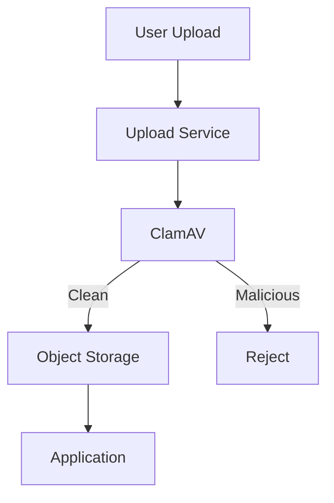

---

# 6. Core Components

## clamscan

Command-line scanner.

```bash
clamscan file.pdf
```

Use cases:

* Manual scanning
* Scripts
* CI/CD

---

## clamd

Daemon mode.

```text
Application
      ↓
clamd
      ↓
Scan Result
```

Provides:

* Faster scans
* Persistent memory
* TCP access

Enterprise deployments almost always use `clamd`.

---

## freshclam

Signature updater.

```text
Internet
    ↓
Freshclam
    ↓
Virus Database
```

Updates:

* Virus definitions
* Security signatures
* Detection rules

---

## Signature Database

Stores:

```text
main.cvd
daily.cvd
bytecode.cvd
```

Contains:

* Malware hashes
* Detection rules
* Heuristics

---

# 7. Internal Working

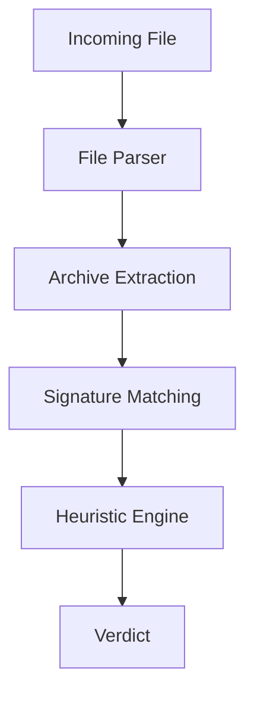

---

# 8. Supported File Types

| Category    | Examples                |
| ----------- | ----------------------- |
| Documents   | PDF, DOCX               |
| Archives    | ZIP, TAR, RAR           |
| Executables | EXE, ELF                |
| Emails      | EML, MIME               |
| Scripts     | JS, VBS                 |
| Images      | Limited metadata checks |

---

# 9. Scan Workflow

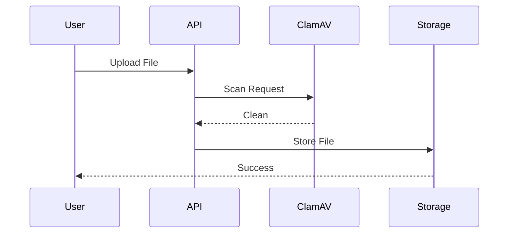

---

# ClamAV on Linux Server — Architecture & Integration

## 1. Basic Linux Standalone Architecture (CLI Mode)

This is the simplest and most direct usage.

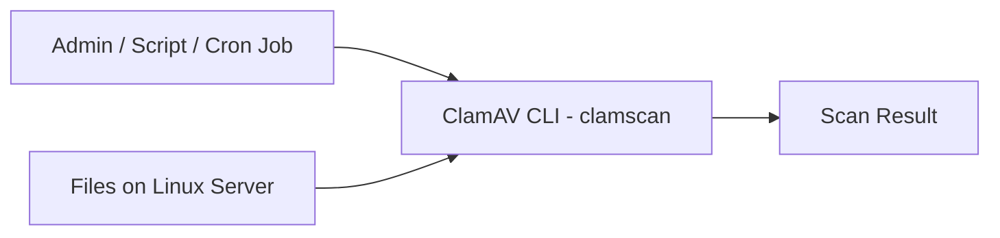

### How it works

* ClamAV runs as a binary (`clamscan`)
* It scans local files directly
* No network communication
* No daemon required

### Example

```bash
clamscan /home/user/uploads/file.pdf
```

---

# 2. Linux Server Production Architecture (Daemon Mode - clamd)

This is the **enterprise-grade Linux setup**.

## Architecture

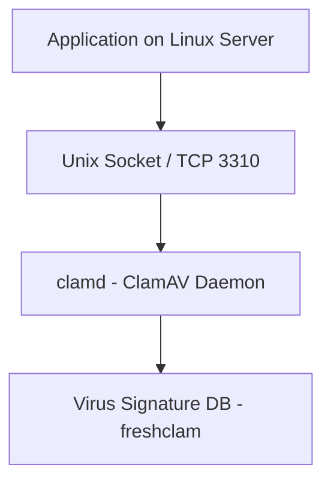

---

## Components

### 1. clamd (Daemon)

* Runs continuously in background
* Keeps signatures in memory
* Much faster than CLI scans

### 2. freshclam

* Updates virus definitions

```text
cron / systemd → freshclam → update DB
```

### 3. Application / Services

* Any Linux service can send files to clamd

---

## How communication works

### Option A: Unix Socket (most common)

```text
/var/run/clamav/clamd.sock
```

### Option B: TCP

```text
127.0.0.1:3310
```

---

## Example Flow

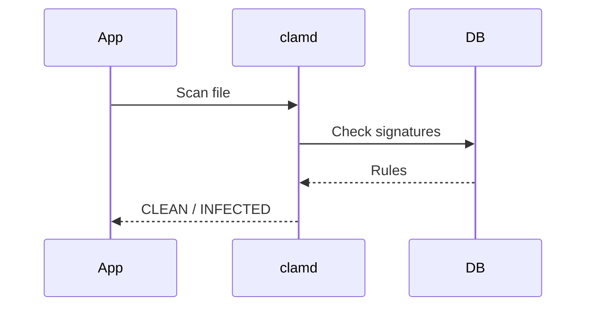

---

# 3. Linux File Upload Server Architecture

This is very common in backend systems.

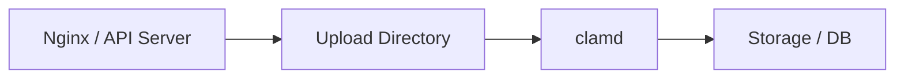

### Flow

1. File uploaded via Nginx or backend
2. Stored temporarily
3. ClamAV scans file
4. If clean → move to permanent storage

---

# 4. Linux Cron-Based Security Scanning

Used in file servers and shared systems.

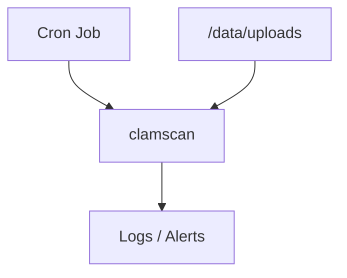

### Example cron job

```bash
0 * * * * clamscan -r /data/uploads >> /var/log/clamav.log
```

---

# 5. Linux Email Server Architecture (Very Common Use Case)

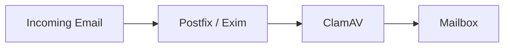

Used to scan:

* attachments
* embedded files

---

# 6. Linux CI/CD Server Architecture

Example with Jenkins or GitLab Runner on Linux.

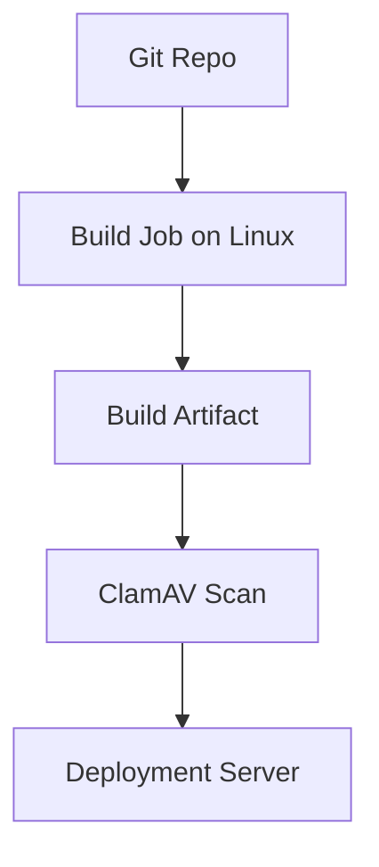

---

# 7. Linux System Architecture Summary

## Two main deployment modes:

| Mode        | Component | Use case           |
| ----------- | --------- | ------------------ |
| CLI mode    | clamscan  | Scripts, CI/CD     |
| Daemon mode | clamd     | Production servers |

---

# 8. Systemd-based Linux Architecture (Modern Setup)

Most modern Linux servers run ClamAV like this:

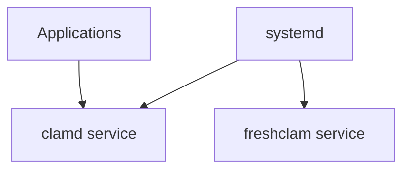

---

## System services

```bash
systemctl start clamav-daemon
systemctl start clamav-freshclam
```

---

# 9. Key Linux Integration Methods

| Method   | Type            | Used in         |
| -------- | --------------- | --------------- |
| clamscan | CLI             | Scripts, CI/CD  |
| clamd    | daemon          | Production apps |
| systemd  | service manager | Linux servers   |
| cron     | scheduled scans | file servers    |
| socket   | IPC             | microservices   |

---

# 10. Important Linux Design Principle

> ClamAV is not a Linux "application" — it is a **system-level scanning service**

It integrates at:

* OS level (systemd, cron)
* Application level (upload APIs)
* Network level (daemon socket)

---

# 11. When Linux servers SHOULD use ClamAV

✔ File upload servers
✔ Shared storage systems
✔ Email gateways
✔ CI/CD build machines
✔ Multi-tenant SaaS backend
✔ Backup servers

---

# 12. When Linux servers SHOULD NOT rely on ClamAV

❌ Endpoint protection (use EDR instead)
❌ Behavioral threat detection
❌ Intrusion detection
❌ Real-time attack prevention

---

# Final Simple Summary (for documentation)

> On Linux systems, ClamAV is deployed either as a command-line scanner (clamscan) or as a background daemon (clamd). Applications interact with it locally via system calls, sockets, or scheduled jobs. It is commonly integrated into file upload systems, email servers, and CI/CD pipelines to ensure files are scanned before processing or storage.


# 10. Kubernetes Deployment Architecture

## Recommended Pattern

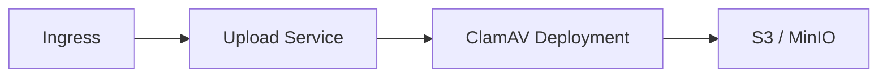

---

## Kubernetes Objects

```text
Deployment
Service
ConfigMap
PersistentVolume
Secret
```

---

# 11. Shared ClamAV Service Pattern

Enterprise preferred design.

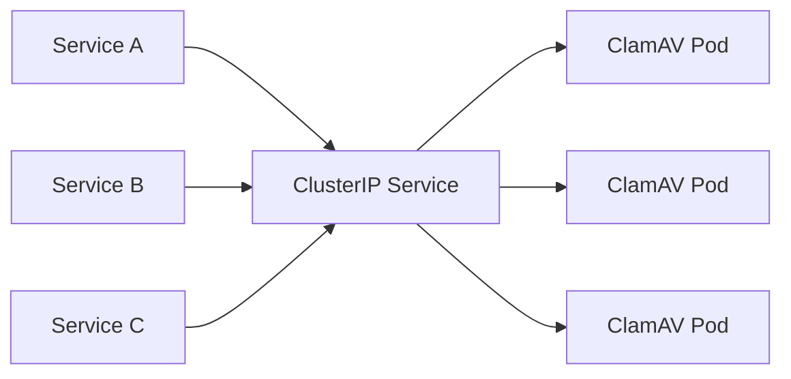

Advantages:

* Centralized updates
* Better resource usage
* Easier operations

---

# 12. Sidecar Deployment Pattern

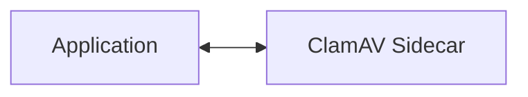

Advantages:

* Isolation

Disadvantages:

* High memory consumption
* Duplicate signatures

Generally not preferred.

---

# 13. Event-Driven Architecture

Large-scale document systems.

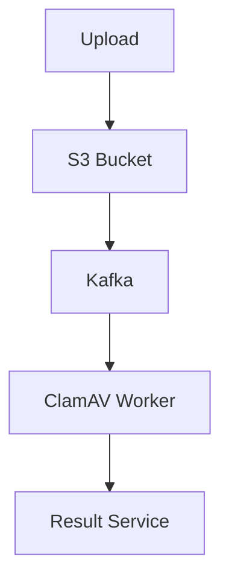

---

# 14. API Gateway Integration

With Kong:

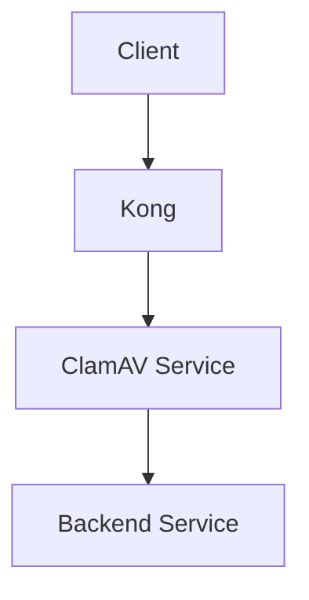

Use when:

* Files enter through APIs
* Centralized validation needed

---

# 15. CI/CD Integration

## Build Artifact Scanning

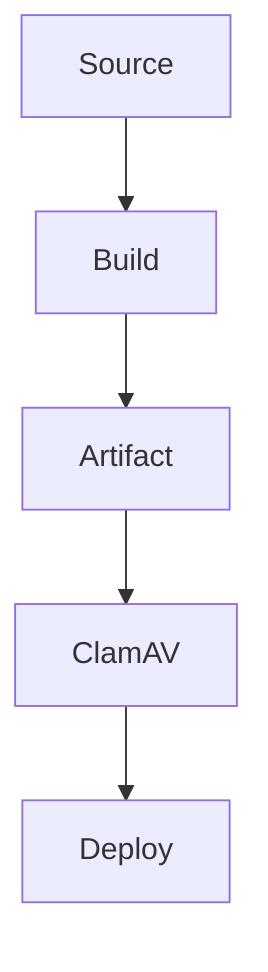

---

## What ClamAV Does Not Replace

| Tool      | Purpose            |
| --------- | ------------------ |
| Semgrep   | SAST               |
| SonarQube | SAST               |
| Snyk      | SCA                |
| Trivy     | Container scanning |
| OWASP ZAP | DAST               |

---

# 16. Email Security Architecture

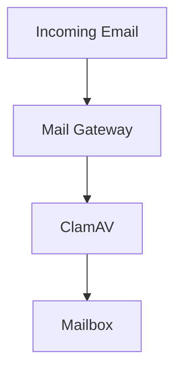

One of the oldest and most common ClamAV deployments.

---

# 17. Scaling Architecture

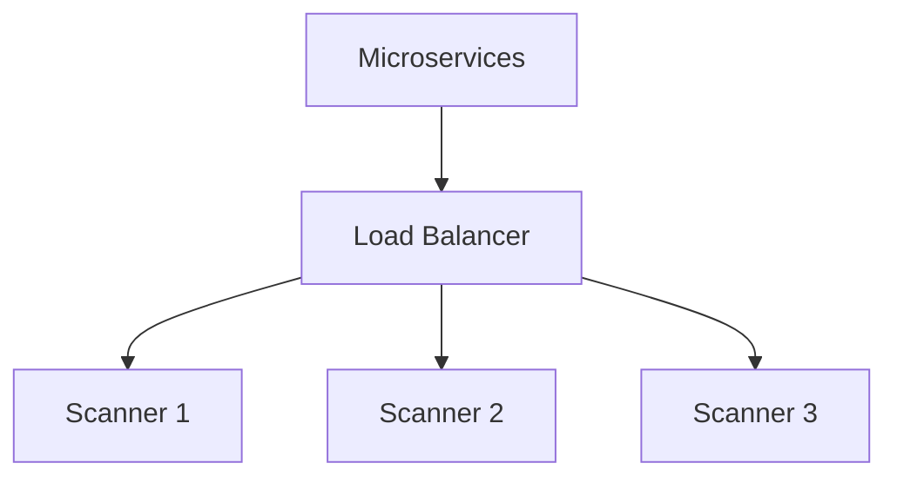

Scaling methods:

* Horizontal Pod Autoscaler
* Multiple clamd instances
* Dedicated scanning nodes

---

# 18. Performance Considerations

Factors affecting performance:

| Factor           | Impact |
| ---------------- | ------ |
| File size        | High   |
| Archive depth    | High   |
| Concurrent scans | High   |
| Signature count  | Medium |
| CPU cores        | High   |

---

# 19. Security Best Practices

### Recommended

* Run as non-root
* Isolate scanning namespace
* Restrict network access
* Scan before persistence
* Monitor signature updates

### Avoid

* Scanning after storage
* Sidecar overuse
* Publicly exposing clamd

---

# 20. Monitoring Architecture

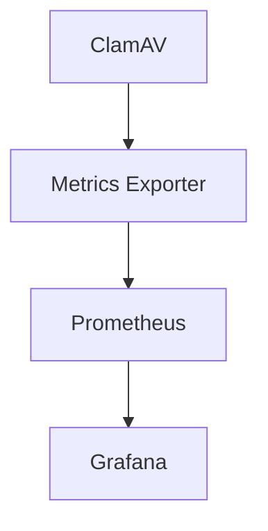

Metrics:

* Scan count
* Scan duration
* Infected files
* Update failures

---

# 21. Enterprise DevSecOps Architecture

```mermaid
flowchart TD

DEV[Developer]

GIT[Git]

SAST[SAST]

SCA[SCA]

BUILD[Build]

TRIVY[Container Scan]

DEPLOY[Kubernetes]

UPLOAD[User Upload]

CLAM[ClamAV]

DEV --> GIT
GIT --> SAST
SAST --> SCA
SCA --> BUILD
BUILD --> TRIVY
TRIVY --> DEPLOY

UPLOAD --> CLAM
CLAM --> DEPLOY
```

---

# 22. ClamAV vs Alternatives

| Feature              | ClamAV    | Commercial EDR |
| -------------------- | --------- | -------------- |
| Open Source          | Yes       | No             |
| Malware Scanning     | Yes       | Yes            |
| Behavioral Detection | Limited   | Strong         |
| Endpoint Protection  | No        | Yes            |
| Kubernetes Friendly  | Yes       | Moderate       |
| File Upload Security | Excellent | Good           |

---

# 23. Advantages & Disadvantages

### Advantages

* Open source
* Lightweight
* Kubernetes friendly
* Easy integration
* Strong community

### Disadvantages

* Limited behavioral analysis
* Not EDR/XDR
* Not SAST/DAST
* Signature-based focus

---

# 24. Production Architecture Recommendation

For modern Kubernetes microservices:

```mermaid
flowchart TD

ALB[AWS ALB]

KONG[Kong]

UPLOAD[Upload Service]

CLAM[ClamAV Cluster]

MINIO[MinIO]

KAFKA[Kafka]

WORKERS[Workers]

ALB --> KONG

KONG --> UPLOAD

UPLOAD --> CLAM

CLAM --> MINIO

MINIO --> KAFKA

KAFKA --> WORKERS
```

This is one of the most common enterprise patterns for secure document-processing platforms.

---

# 25. Frequently Asked Questions

| Question                      | Answer                          |
| ----------------------------- | ------------------------------- |
| Is ClamAV an API Gateway?     | No                              |
| Is ClamAV a SAST tool?        | No                              |
| Is ClamAV a DAST tool?        | No                              |
| Can it run on Kubernetes?     | Yes                             |
| Can it be deployed with Helm? | Yes                             |
| Does it scan uploaded files?  | Yes                             |
| Is it suitable for CI/CD?     | For artifact/file scanning, yes |
| Does it replace Trivy?        | No                              |
| Does it replace CrowdStrike?  | No                              |

Yes, ClamAV can absolutely be integrated with **Git**, **Bitbucket**, **GitHub**, **GitLab**, **Jenkins**, **Azure DevOps**, and other CI/CD systems.

However, there is a very important distinction:

> **ClamAV scans files and artifacts, not source code vulnerabilities.**

Many organizations initially think:

```text
Git Repository
       ↓
ClamAV
       ↓
Secure Code
```

but that is not what ClamAV is designed for.

A more accurate view is:

```text
Git Repository
      ↓
Build Artifact
      ↓
ClamAV Scan
      ↓
Deploy
```

---

# 26. Git Integration

## Can ClamAV Scan Git Repositories?

Yes.

Example:

```bash
clamscan -r .
```

This scans:

```text
project/
├── src/
├── scripts/
├── uploads/
├── binaries/
└── vendor/
```

Useful for detecting:

* Malicious binaries
* Infected scripts
* Suspicious files accidentally committed

Not useful for:

* SQL Injection
* XSS
* Hardcoded secrets
* Vulnerable code

---

## Git Pre-Commit Hook

```mermaid
flowchart TD

DEV[Developer]

COMMIT[Git Commit]

CLAM[ClamAV Scan]

REPO[Repository]

DEV --> COMMIT

COMMIT --> CLAM

CLAM -->|Pass| REPO

CLAM -->|Fail| BLOCK[Block Commit]
```

Example:

```bash
#!/bin/bash

clamscan -r .

if [ $? -ne 0 ]; then
   echo "Malware detected"
   exit 1
fi
```

Rarely used but possible.

---

# 27. GitHub Actions Integration

```mermaid
flowchart TD

PUSH[Git Push]

ACTION[GitHub Action]

BUILD[Build]

CLAM[ClamAV]

DEPLOY[Deploy]

PUSH --> ACTION

ACTION --> BUILD

BUILD --> CLAM

CLAM --> DEPLOY
```

Typical workflow:

```yaml
- name: Install ClamAV
  run: apt-get install clamav

- name: Update Definitions
  run: freshclam

- name: Scan Artifact
  run: clamscan release.zip
```

---

# 28. Bitbucket Pipeline Integration
```mermaid
flowchart TD

DEV[Developer]
BITBUCKET[Bitbucket]
PIPELINE[Pipeline]
CLAM[ClamAV]
ARTIFACT[Artifact]

DEV --> BITBUCKET
BITBUCKET --> PIPELINE
PIPELINE --> CLAM
CLAM --> ARTIFACT
```

Example use cases:

* Scan ZIP releases
* Scan Docker build context
* Scan uploaded binaries
* Scan vendor packages

---

# 29. GitLab CI Integration

```mermaid
flowchart TD

GITLAB[GitLab]
BUILD[Build Stage]
CLAM[ClamAV]
REGISTRY[Container Registry]
DEPLOY[Deployment]

GITLAB --> BUILD
BUILD --> CLAM
CLAM --> REGISTRY
REGISTRY --> DEPLOY
```

---

# 30. Jenkins Integration

```mermaid
flowchart TD

CODE[Git]

JENKINS[Jenkins]

BUILD[Build]

CLAM[ClamAV]

DEPLOY[Deployment]

CODE --> JENKINS

JENKINS --> BUILD

BUILD --> CLAM

CLAM --> DEPLOY
```

Common in enterprise environments.

---

# 31. DevSecOps Tool Comparison

This is where many architects become confused.

## Security Tool Categories

```mermaid
flowchart LR

SAST[SAST]

SCA[SCA]

DAST[DAST]

IMAGE[Image Scan]

RUNTIME[Runtime]

MALWARE[Malware Scan]

SAST --> APP[Application Security]

SCA --> APP

DAST --> APP

IMAGE --> CONTAINER[Container Security]

RUNTIME --> CONTAINER

MALWARE --> FILES[File Security]
```

---

# 32. ClamAV vs Semgrep

| Feature              | ClamAV | Semgrep |
| -------------------- | ------ | ------- |
| Malware Detection    | ✅      | ❌       |
| Source Code Analysis | ❌      | ✅       |
| SAST                 | ❌      | ✅       |
| Kubernetes Friendly  | ✅      | ✅       |
| CI/CD                | ✅      | ✅       |
| Upload Security      | ✅      | ❌       |

Winner:

```text
Different purposes
```

Use both.

---

# 33. ClamAV vs SonarQube

| Feature              | ClamAV | SonarQube |
| -------------------- | ------ | --------- |
| Malware Detection    | ✅      | ❌         |
| Code Quality         | ❌      | ✅         |
| Security Rules       | ❌      | ✅         |
| Technical Debt       | ❌      | ✅         |
| File Upload Security | ✅      | ❌         |

Winner:

```text
Different categories
```

---

# 34. ClamAV vs Snyk

| Feature               | ClamAV  | Snyk   |
| --------------------- | ------- | ------ |
| Malware Files         | ✅       | ❌      |
| Dependency CVEs       | ❌       | ✅      |
| Supply Chain Security | Partial | Strong |
| OSS Libraries         | ❌       | ✅      |

Winner:

```text
Snyk for dependencies
ClamAV for malware
```

---

# 35. ClamAV vs Trivy

This is the comparison most Kubernetes teams care about.

| Feature             | ClamAV | Trivy   |
| ------------------- | ------ | ------- |
| Malware Detection   | ✅      | Limited |
| Container CVEs      | ❌      | ✅       |
| Kubernetes Scanning | ❌      | ✅       |
| Helm Chart Scan     | ❌      | ✅       |
| Docker Image Scan   | ❌      | ✅       |
| Upload Security     | ✅      | ❌       |

### Kubernetes Reality

Most teams use:

```mermaid
flowchart LR

IMAGE[Container Image]

TRIVY[Trivy]

DEPLOY[Deploy]

UPLOAD[User Files]

CLAM[ClamAV]

IMAGE --> TRIVY

TRIVY --> DEPLOY

UPLOAD --> CLAM
```

Not one or the other.

Both.

---

# 36. ClamAV vs CrowdStrike

| Feature              | ClamAV  | CrowdStrike |
| -------------------- | ------- | ----------- |
| Open Source          | ✅       | ❌           |
| Endpoint Security    | ❌       | ✅           |
| Behavioral Detection | Limited | Advanced    |
| Threat Hunting       | ❌       | ✅           |
| File Scanning        | ✅       | ✅           |
| Cost                 | Free    | Expensive   |

Winner:

```text
Enterprise endpoint security → CrowdStrike
Server-side file scanning → ClamAV
```

---

# 37. ClamAV vs Microsoft Defender

| Feature             | ClamAV | Defender |
| ------------------- | ------ | -------- |
| Open Source         | ✅      | ❌        |
| Endpoint Protection | ❌      | ✅        |
| Malware Scan        | ✅      | ✅        |
| Cloud Security      | ❌      | ✅        |
| EDR                 | ❌      | ✅        |

---

# 38. Complete Enterprise Security Stack

A mature enterprise platform often looks like this:

```mermaid
flowchart TD

DEV[Developer]

GIT[Git]

SEMGREP[Semgrep]

SONAR[SonarQube]

SNYK[Snyk]

TRIVY[Trivy]

BUILD[Build]

K8S[Kubernetes]

FALCO[Falco]

UPLOAD[Uploads]

CLAM[ClamAV]

DEV --> GIT

GIT --> SEMGREP

SEMGREP --> SONAR

SONAR --> SNYK

SNYK --> BUILD

BUILD --> TRIVY

TRIVY --> K8S

K8S --> FALCO

UPLOAD --> CLAM
```

---

# 39. Where ClamAV SHOULD Be Used

### Excellent Use Cases

✅ SaaS platforms

```text
Resume Uploads
Invoice Uploads
Document Uploads
Customer Attachments
```

---

✅ Banking

```text
KYC Documents
Statements
Customer Uploads
```

---

✅ Healthcare

```text
Patient Documents
Medical Reports
Lab Results
```

---

✅ Email Gateways

```text
Incoming Attachments
Outgoing Attachments
```

---

✅ Shared Storage

```text
S3
MinIO
NFS
NAS
```

---

# 40. Where ClamAV SHOULD NOT Be Used

❌ As a replacement for:

* Semgrep
* SonarQube
* Trivy
* Snyk
* OWASP ZAP
* CrowdStrike

❌ To find:

* SQL Injection
* XSS
* SSRF
* Secrets
* Dependency vulnerabilities
* Kubernetes misconfigurations

---

# 41. Final Recommendation

## For a Kubernetes + Microservices + Kong + CI/CD Environment

My recommendation would be:

```mermaid
flowchart TD

GIT[Git]

SAST[Semgrep]

SCA[Snyk]

TRIVY[Trivy]

KONG[Kong]

K8S[Kubernetes]

UPLOAD[File Upload]

CLAM[ClamAV]

GIT --> SAST

SAST --> SCA

SCA --> TRIVY

TRIVY --> K8S

UPLOAD --> CLAM

CLAM --> K8S

KONG --> K8S
```

### Should you use ClamAV?

**YES**, if:

* Users upload files
* You process documents
* You handle email attachments
* You ingest third-party files
* Compliance requires malware scanning

**NO**, if:

* You only have APIs and microservices
* No file uploads exist
* You're looking for SAST/DAST/container security

### Enterprise Verdict

For modern cloud-native platforms:

| Tool      | Recommendation                             |
| --------- | ------------------------------------------ |
| Semgrep   | Mandatory                                  |
| SonarQube | Recommended                                |
| Snyk      | Recommended                                |
| Trivy     | Mandatory                                  |
| Falco     | Recommended                                |
| ClamAV    | Mandatory only if files enter the platform |

So the practical conclusion is:

> **ClamAV is not a core Kubernetes or CI/CD security tool like Trivy, Semgrep, or Snyk. It becomes essential when your platform accepts files from users, partners, email systems, or external sources. In that scenario, ClamAV is still the de facto open-source malware scanning solution used in enterprise environments.**

## ClamAV Reference Links (Official & Trusted Sources)
| Category               | Description                                                 | Link                                                                                                                                                       |
| ---------------------- | ----------------------------------------------------------- | ---------------------------------------------------------------------------------------------------------------------------------------------------------- |
| Official Website       | Main ClamAV project site (Cisco Talos)                      | [https://www.clamav.net](https://www.clamav.net) ([ClamAV Documentation][1])                                                                               |
| Official Documentation | Full technical documentation (installation, usage, configs) | [https://docs.clamav.net](https://docs.clamav.net) ([ClamAV Documentation][1])                                                                             |
| Installation Guide     | How to install ClamAV on Linux/macOS/Windows                | [https://docs.clamav.net/manual/Installing.html](https://docs.clamav.net/manual/Installing.html) ([ClamAV Documentation][2])                               |
| Signature Management   | Virus database updates (freshclam, signatures, rules)       | [https://docs.clamav.net/manual/Usage/SignatureManagement.html](https://docs.clamav.net/manual/Usage/SignatureManagement.html) ([ClamAV Documentation][3]) |
| Packages (Linux)       | Official packaging & distro installation details            | [https://docs.clamav.net/manual/Installing/Packages.html](https://docs.clamav.net/manual/Installing/Packages.html) ([ClamAV Documentation][4])             |
| Docker Images          | Official ClamAV container images                            | [https://hub.docker.com/r/clamav/clamav](https://hub.docker.com/r/clamav/clamav)                                                                           |
| Docker Debian Image    | ClamAV Debian-based container                               | [https://hub.docker.com/r/clamav/clamav-debian](https://hub.docker.com/r/clamav/clamav-debian)                                                             |
| Malware Submission     | Submit malware samples for analysis                         | [https://www.clamav.net/reports/malware](https://www.clamav.net/reports/malware)                                                                           |
| False Positive Reports | Report incorrect detections                                 | [https://www.clamav.net/reports/fp](https://www.clamav.net/reports/fp)                                                                                     |
| GitHub Repository      | Source code of ClamAV engine                                | [https://github.com/Cisco-Talos/clamav](https://github.com/Cisco-Talos/clamav)                                                                             |
| Talos Intelligence     | Cisco security research team behind ClamAV                  | [https://talosintelligence.com](https://talosintelligence.com)                                                                                             |

[1]: https://docs.clamav.net/?utm_source=chatgpt.com "Introduction - ClamAV Documentation"
[2]: https://docs.clamav.net/manual/Installing.html?utm_source=chatgpt.com "Installing - ClamAV Documentation"
[3]: https://docs.clamav.net/manual/Usage/SignatureManagement.html?utm_source=chatgpt.com "Updating Signature Databases - ClamAV Documentation"
[4]: https://docs.clamav.net/manual/Installing/Packages.html?highlight=update&utm_source=chatgpt.com "Packages - ClamAV Documentation"
