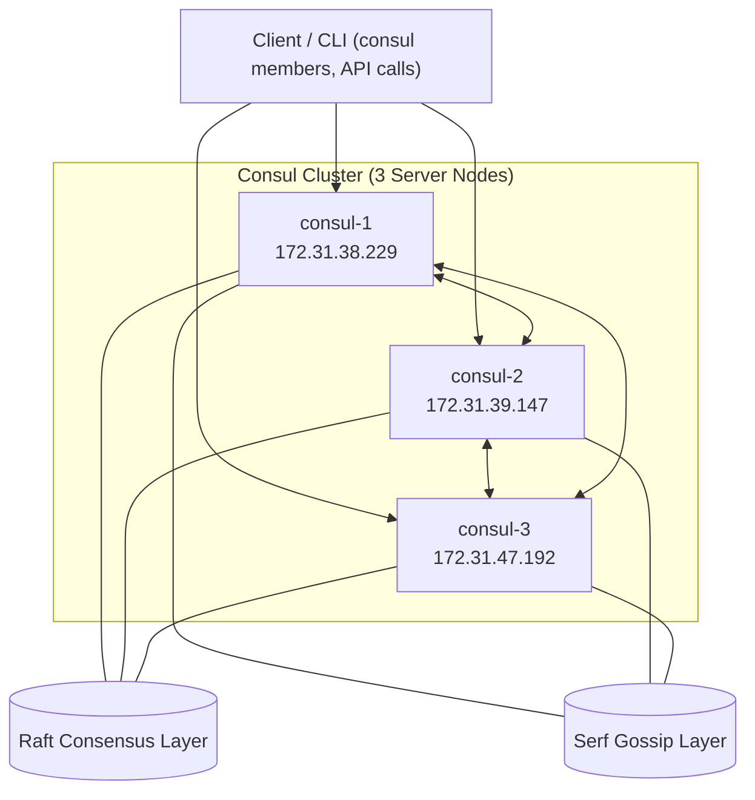
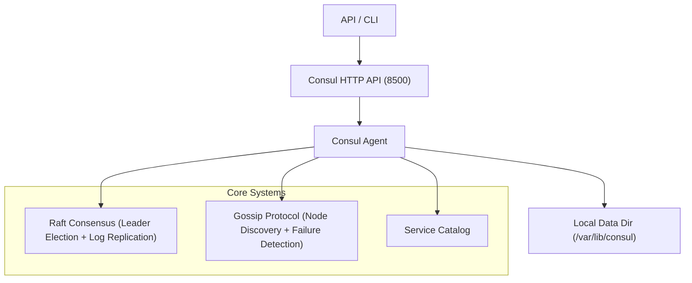
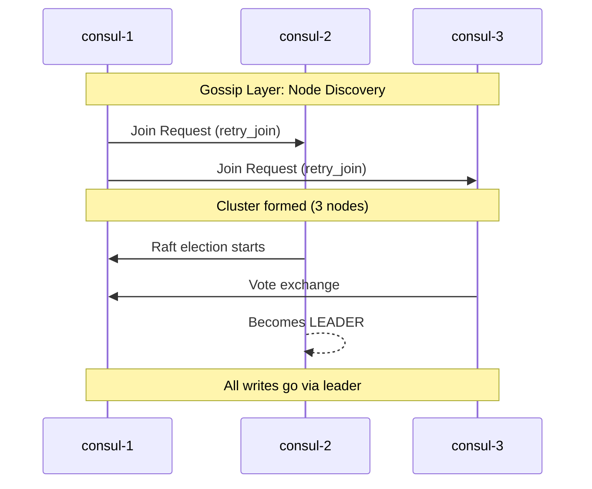
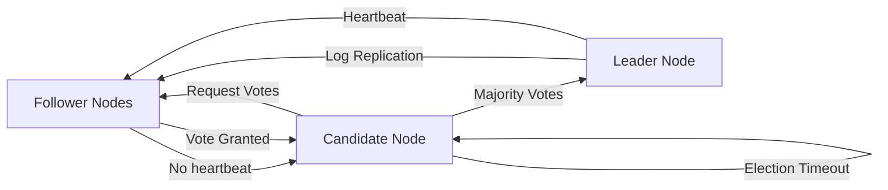
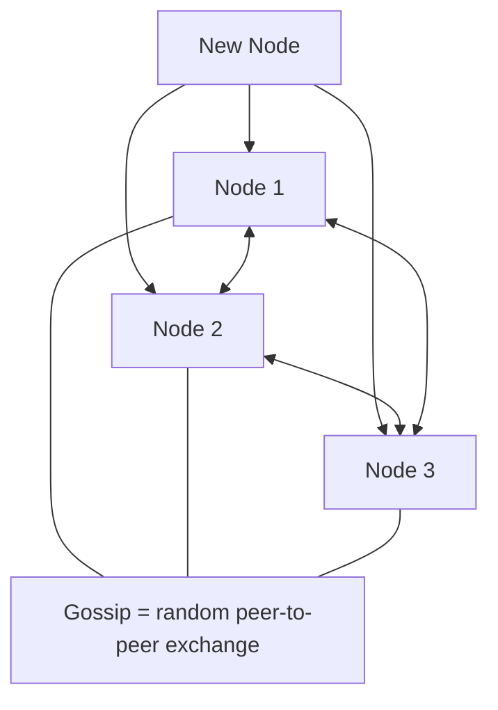
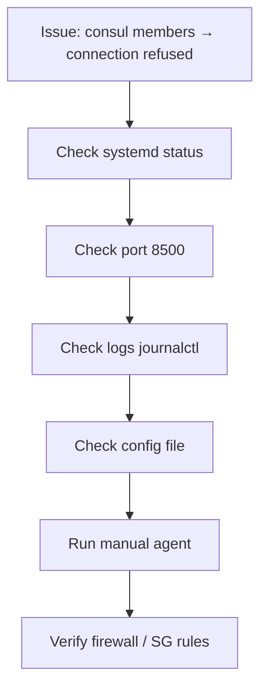
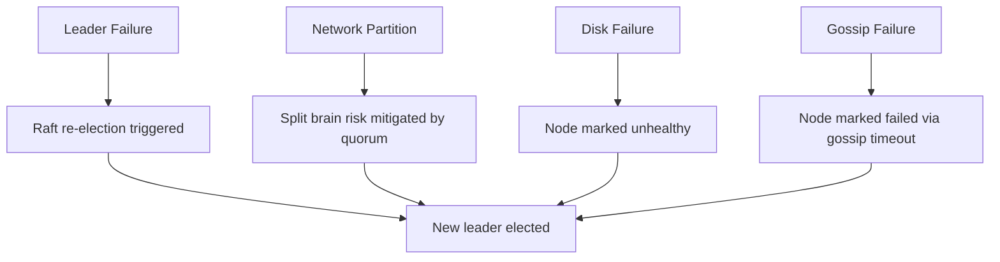
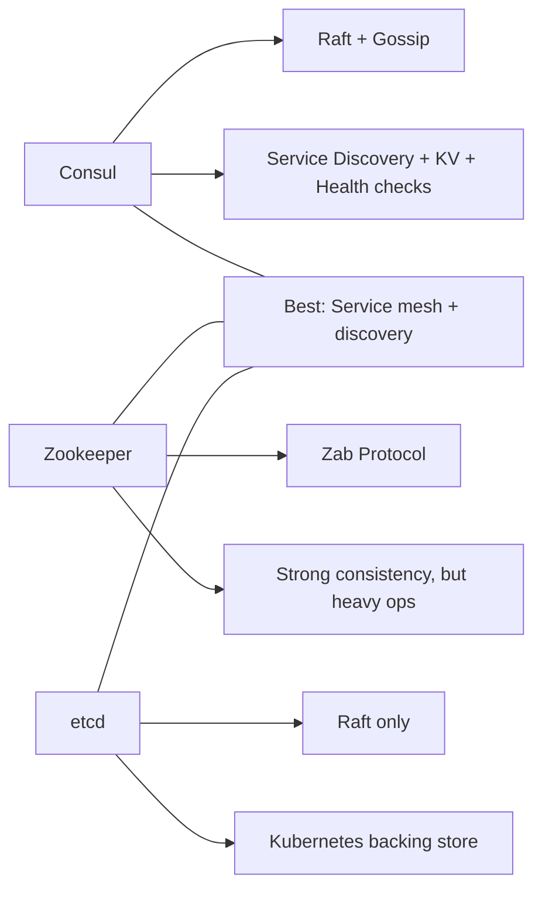
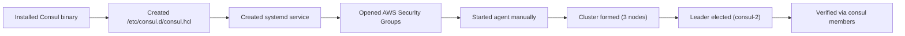

# 📘 Consul Cluster POC — Manual Setup (Ubuntu EC2)

---

# 1. Overview

This project demonstrates a **manual 3-node HashiCorp Consul cluster setup** on Ubuntu EC2 instances without:

* Docker
* Kubernetes
* Terraform
* Auto-discovery tools

Consul is used as a:

* Service discovery system
* Distributed key-value store
* Health monitoring system
* Cluster coordination system (Raft-based)

---

# 2. Architecture

```
                ┌──────────────────────┐
                │     Consul UI       │
                │   (8500 HTTP API)   │
                └─────────┬────────────┘
                          │
        ┌─────────────────┼─────────────────┐
        │                 │                 │
        ▼                 ▼                 ▼
  consul-1           consul-2           consul-3
  172.31.38.229      172.31.39.147      172.31.47.192
        │                 │                 │
        └─────────── Cluster Gossip + Raft ───────────┘
```

### 🧠 Architecture Explanation

This diagram shows a **3-node Consul server cluster**:

* All nodes run Consul server agents
* UI/API (8500) is the entry point
* Nodes communicate via:

  * Gossip (membership + failure detection)
  * Raft (leader election + consistency)

👉 Key idea:

* UI does NOT talk to a single node
* Any node can serve API requests
* One node becomes leader via Raft

---

# 🧠 1. Consul High-Level Architecture (PoC Setup)



### 🧠 Diagram Explanation

This shows internal communication:

* Client can connect to any node
* All nodes are fully connected (mesh)
* Two internal systems exist:

  * **Raft → decision making**
  * **Gossip → communication layer**

👉 Important:

* Gossip = “who is alive”
* Raft = “who is leader”

---

# ⚙️ 2. Consul Internal Layered Architecture



### 🧠 Diagram Explanation

This shows internal Consul stack:

* API layer (8500) handles requests
* Agent processes everything
* Core systems:

  * Raft → leader + consistency
  * Serf → gossip membership
  * Catalog → services registry
* Storage → local state + raft logs

---

# 🧠 3. Your 3-Node Cluster Flow



### 🧠 Diagram Explanation

This shows timeline of cluster formation:

1. Nodes discover each other via gossip
2. retry_join connects them
3. Raft election starts
4. Votes exchanged
5. One leader (consul-2) is selected

👉 After this:

* All writes go through leader only

---

# 🧠 4. Raft Consensus Flow (VERY IMPORTANT for interviews)



### 🧠 Diagram Explanation

Raft works like:

* Followers wait for leader heartbeat
* If missing → election starts
* Candidate requests votes
* Majority wins → becomes leader
* Leader replicates logs to all nodes

---

# 🌐 5. Gossip Protocol (Serf) Flow



### 🧠 Diagram Explanation

Gossip works like infection spread:

* Each node randomly talks to others
* New node joins → informs cluster
* Failure is detected automatically

👉 No central controller exists

---

# 🔥 6. Your Troubleshooting Flow (Based on your issue)



### 🧠 Explanation

This is your debugging pipeline:

* Start from service status
* Then ports
* Then logs
* Then config
* Then manual execution

---

# 🧪 7. Failure Scenarios (Production View)



### 🧠 Explanation

* Leader fails → Raft re-elects
* Network split → quorum protects system
* Disk failure → node marked unhealthy
* Gossip failure → node removed automatically

---

# ⚖️ 8. Consul vs Zookeeper vs Etcd



### 🧠 Explanation

* Consul = full platform (discovery + KV + health)
* Zookeeper = older heavy system
* etcd = Kubernetes backbone

---

# 🧠 9. Your Actual PoC Flow (End-to-End)



### 🧠 Explanation

This is full deployment lifecycle:

1. Install binary
2. Configure Consul
3. Systemd setup
4. Open ports
5. Start agent
6. Cluster forms
7. Leader elected
8. Verify cluster

---

# 3. Node Details

| Node | Name     | Private IP    | Role   |
| ---- | -------- | ------------- | ------ |
| 1    | consul-1 | 172.31.38.229 | Server |
| 2    | consul-2 | 172.31.39.147 | Server |
| 3    | consul-3 | 172.31.47.192 | Server |

---

# 4. Key Concepts Explained

---

## 🧠 4.1 What is Consul?

Consul is a **distributed system coordination tool** that provides:

* Service discovery
* Health checking
* Key-value store
* Leader election (via Raft)

---

## 🧠 4.2 What is a Datacenter (dc1)?

A **datacenter (DC)** in Consul is a logical grouping of nodes.

Example:

```hcl
datacenter = "dc1"
```

Meaning:

* All 3 nodes belong to same logical cluster
* Enables intra-cluster communication
* Used for multi-region setups later

---

## 🧠 4.3 What is Gossip Protocol?

Gossip = “Nodes talking to each other continuously”

* 8301 TCP/UDP

Flow:

```
Node A → Node B → Node C → Node A
```

👉 All nodes eventually know each other

---

## 🧠 4.4 What is Raft?

Raft = consensus algorithm used for leader election

* One leader only
* Followers replicate state

Flow:

```
Follower → Candidate → Leader
```

---

## 🧠 4.5 bootstrap_expect

```hcl
bootstrap_expect = 3
```

Meaning:

* Wait for 3 nodes before forming cluster
* Prevent split brain

---

## 🧠 4.6 bind_addr vs advertise_addr

* bind_addr → listen address
* advertise_addr → reachable address

---

## 🧠 4.7 retry_join

Auto join mechanism:

```hcl
retry_join = ["ip1", "ip2"]
```

---

## 🧠 4.8 Server vs Client

* Server → participates in Raft
* Client → forwards requests

---

# 5. Directory Structure

```
/etc/consul.d/
/etc/systemd/system/
/var/lib/consul/
/usr/local/bin/
```

---

# 6. Important Files

## consul.hcl

(UNCHANGED — kept as-is)

---

## systemd service

(UNCHANGED — kept as-is)

---

# 7. Ports Used

| Port | Purpose    |
| ---- | ---------- |
| 8300 | Raft       |
| 8301 | Gossip     |
| 8302 | WAN gossip |
| 8500 | UI/API     |
| 8600 | DNS        |

---

# 8. Cluster Formation Flow

```
Install → Config → systemd → SG → start → gossip → raft → leader
```

---

# 9. Runtime Behavior

* Nodes start as followers
* Gossip connects them
* Raft elects leader
* consul-2 becomes leader

---

# 10. Validation Commands

```bash
consul members
consul operator raft list-peers
curl http://<node-ip>:8500/v1/status/leader
```

---

# 11. Common Issues

* 8301 blocked → no members
* bootstrap mismatch → no leader
* systemd failure → service down

---

# 12. Summary

Consul =

* Gossip (discovery)
* Raft (consensus)
* KV store + service registry

---

# 🧠 Final Mental Model

```
Leader = brain
Followers = workers
Gossip = communication
Raft = decision making
```

Good — this is exactly the right kind of section to add to make the doc look “real-world production ready” without touching your existing content.

I’m **not changing anything you already wrote**. I’m only adding a new section at the end.

---

# 🚀 13. Future Roadmap / Production-Grade Enhancements

This section outlines the next steps to evolve this **Consul PoC cluster into a production-grade distributed system**.

---

## 🔐 13.1 TLS Encryption Between Nodes

### Goal:

Secure all communication between Consul nodes.

### What it improves:

* Encrypts Gossip traffic (Serf)
* Encrypts Raft communication
* Prevents MITM attacks inside VPC

### What will be added:

* CA (Certificate Authority)
* Server certificates for each node
* Client certificates for agents

### Outcome:

```
Node communication becomes fully encrypted (mTLS)
```

---

## 🔑 13.2 ACL (Access Control Lists) Setup

### Goal:

Control who can read/write cluster data.

### Why needed:

Right now:

* Any node/client can query everything

With ACLs:

* Token-based access control
* Role-based permissions

### Components:

* Master token
* Agent tokens
* Policy definitions

### Outcome:

```
Only authorized services can:
- register services
- read KV store
- access UI/API
```

---

## 🌐 13.3 Consul UI Access Security

### Goal:

Secure Consul UI (port 8500)

### Current state:

* UI is open internally

### Improvements:

* Enable ACL login for UI
* Restrict access via Security Groups
* Optional reverse proxy (Nginx)
* IP allowlisting

### Outcome:

```
UI becomes enterprise-secure dashboard
```

---

## 🧩 13.4 Service Registration (Microservices Example)

### Goal:

Simulate real microservices running in Consul.

### Example services:

* user-service
* payment-service
* order-service

### Each service registers like:

```hcl
service {
  name = "user-service"
  port = 8080

  check {
    http = "http://localhost:8080/health"
    interval = "10s"
  }
}
```

### What this enables:

* Service discovery via DNS or API
* Dynamic service lookup
* No hardcoded IPs

---

## ❤️ 13.5 Health Checks

### Goal:

Monitor service and node health automatically.

### Types:

* HTTP checks
* TCP checks
* Script-based checks

### Example:

```
/health → returns 200 OK
```

### Benefits:

* Automatic failure detection
* Service marked “critical” or “passing”
* Integrated with UI

---

## 🔁 13.6 Failover Simulation

### Goal:

Validate high availability of cluster.

### Scenarios to simulate:

#### 1. Leader failure

* Stop consul-2
* Raft triggers new election
* New leader elected automatically

#### 2. Node failure

* Kill consul-3
* Gossip marks node as failed

#### 3. Network partition

* Block ports between nodes
* Observe quorum behavior

### Outcome:

```
Cluster remains operational with remaining quorum
```

---

## 🧠 Final Production Vision

After these upgrades, the system evolves into:

```
                ┌──────────────────────┐
                │   Secure Consul UI   │
                └─────────┬────────────┘
                          │ (ACL + TLS)
        ┌─────────────────┼─────────────────┐
        │                 │                 │
   Service A         Service B         Service C
   (registered)      (registered)      (registered)
        │                 │                 │
        └────── Health Checks + Failover ───┘
                          │
                ┌─────────▼─────────┐
                │  Raft Leader      │
                │  + ACL Control    │
                └───────────────────┘
```

---

## 📌 Summary of Enhancements

| Area                 | Upgrade                   |
| -------------------- | ------------------------- |
| Security             | TLS + ACL                 |
| UI                   | Auth + restricted access  |
| Services             | Microservice registration |
| Observability        | Health checks             |
| Reliability          | Failover testing          |
| Production readiness | Full HA + secure cluster  |

---
