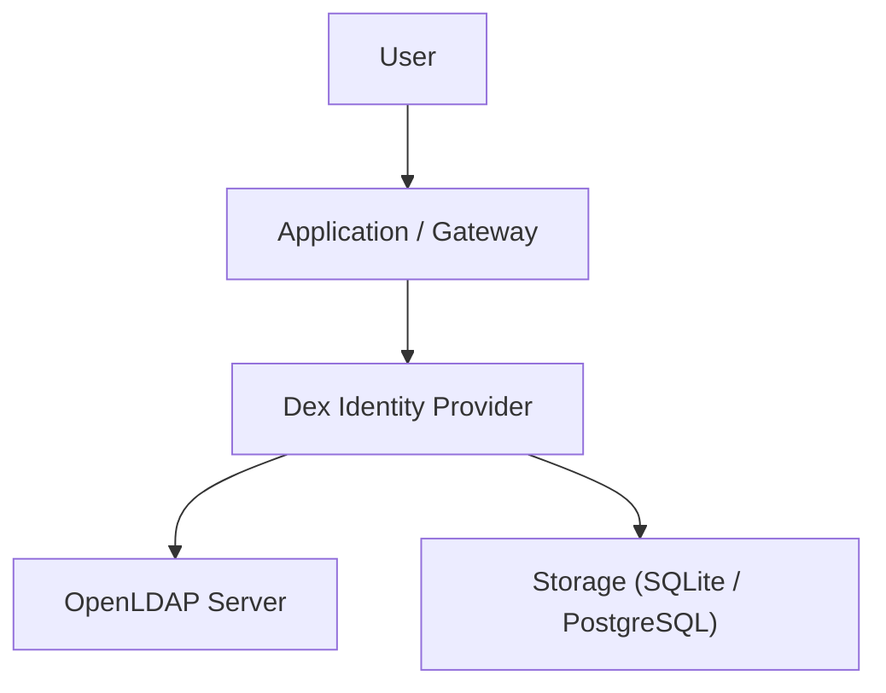

# DEX IDENTITY PROVIDER — BARE METAL INSTALLATION GUIDE


# 1. Introduction

Modern infrastructure requires centralized authentication and authorization for applications, APIs, and microservices.

In distributed systems, managing:

* user authentication
* LDAP integration
* SSO (Single Sign-On)
* OAuth2 / OIDC flows
* group-based access control

becomes complex without a dedicated identity provider.

**Dex is a cloud-native OpenID Connect (OIDC) identity provider that acts as a bridge between external identity systems (LDAP, SAML, GitHub, etc.) and modern authentication systems.**


# 2. Objective

This document explains:

* What Dex is
* Why Dex is required
* System prerequisites
* Installation on bare metal Linux
* Source build process
* Binary installation steps
* Systemd service setup
* LDAP integration readiness
* Production deployment considerations

---

# 3. What is Dex?

Dex is an identity provider that implements **OpenID Connect (OIDC)**.

It acts as a middleware between identity sources and applications.

---

## Dex Authentication Flow

```txt id="dexflow1"
User
  ↓
Dex Login Page
  ↓
LDAP / Identity Provider
  ↓
Dex (OIDC Token Issuer)
  ↓
Application (Kong / Hoop / Kubernetes / Apps)
```

# 4. Why Dex is Required

Without Dex:

```txt id="noidp"
Applications → Direct LDAP Integration
Applications → Separate Authentication Logic
```

Problems:

| Problem                  | Description                       |
| ------------------------ | --------------------------------- |
| No SSO                   | Each app handles login separately |
| Security inconsistency   | Different auth logic per service  |
| Hard LDAP integration    | Apps directly depend on LDAP      |
| No token standardization | No OAuth/OIDC support             |

---

With Dex:

```txt id="withdex"
Applications → Dex → LDAP / Identity Providers
```

Benefits:

| Benefit                    | Description               |
| -------------------------- | ------------------------- |
| Centralized authentication | Single login system       |
| OIDC support               | Standard token-based auth |
| LDAP integration           | Works with OpenLDAP       |
| Kubernetes support         | Native integration        |
| Microservice friendly      | Works with API gateways   |


# 5. System Architecture



---

# 6. System Requirements

## 6.1 Operating System

* Ubuntu 20.04+
* Ubuntu 22.04+ (Recommended)
* Debian 11+
* RHEL 8+

---

## 6.2 Hardware Requirements

| Resource | Minimum | Recommended |
| -------- | ------- | ----------- |
| CPU      | 1 Core  | 2+ Cores    |
| RAM      | 512 MB  | 2 GB+       |
| Disk     | 2 GB    | 10 GB+      |


## 6.3 Network Requirements

* DNS name (e.g. `dex.company.com`)
* Ports:

  * 443 (HTTPS recommended)
  * 5556 (default HTTP port)
* Outbound access to LDAP server

---

## 6.4 Required Packages

```bash id="deps1"
sudo apt update
sudo apt install -y curl git ca-certificates tar gzip openssl
```

---

## 6.5 Build Dependencies (Bare Metal Source Build)

```bash id="deps2"
sudo apt install -y make gcc golang-go
```

---

# 7. Installation Methods

Dex can be installed using:

| Method               | Use Case                    |
| -------------------- | --------------------------- |
| Source Build         | Development / Custom builds |
| Binary Install       | Older versions              |
| Docker (Recommended) | Production systems          |
| Kubernetes Helm      | Cloud-native deployments    |

---

# 8. Bare Metal Installation (Source Build)

---

## 8.1 Clone Repository

```bash id="clone1"
git clone https://github.com/dexidp/dex.git
cd dex
```

---

## 8.2 Checkout Stable Version

```bash id="checkout1"
git checkout v2.45.1
```

---

## 8.3 Install Build Tools

```bash id="buildtools"
sudo apt install -y make gcc golang-go
```

## 8.4 Build Dex

```bash id="builddex"
make build
```

## 8.5 Verify Binary

```bash id="verifybin"
ls -lh bin/
```

Expected output:

```txt id="binout"
dex (≈ 40MB)
```

---

## 8.6 Install Binary

```bash id="installbin"
sudo mv bin/dex /usr/local/bin/
sudo chmod +x /usr/local/bin/dex
```

---

## 8.7 Verify Installation

```bash id="verifydex"
dex version
```

---

# 9. Configuration Setup

---

## 9.1 Create Config Directory

```bash id="cfgdir"
sudo mkdir -p /etc/dex
sudo mkdir -p /var/lib/dex
```

---

## 9.2 Sample Configuration File

```yaml id="config1"
issuer: https://dex.company.com

storage:
  type: sqlite3
  config:
    file: /var/lib/dex/dex.db

web:
  http: 0.0.0.0:5556

oauth2:
  skipApprovalScreen: true

logger:
  level: info
```

---

# 10. LDAP Integration (OpenLDAP)

---

## 10.1 LDAP Connector Example

```yaml id="ldap1"
connectors:
- type: ldap
  id: ldap
  name: OpenLDAP
  config:
    host: ldap.company.local:389

    bindDN: cn=admin,dc=company,dc=com
    bindPW: "password"

    userSearch:
      baseDN: ou=users,dc=company,dc=com
      filter: "(objectClass=person)"
      username: uid
      emailAttr: mail
      nameAttr: cn

    groupSearch:
      baseDN: ou=groups,dc=company,dc=com
      filter: "(objectClass=groupOfNames)"
      userMatchers:
      - userAttr: DN
        groupAttr: member
      nameAttr: cn
```

---

# 11. Systemd Service Setup

---

## 11.1 Create Service File

```bash id="service1"
sudo nano /etc/systemd/system/dex.service
```

---

## 11.2 Service Definition

```ini id="service2"
[Unit]
Description=Dex Identity Provider
After=network.target

[Service]
User=root
ExecStart=/usr/local/bin/dex serve /etc/dex/config.yaml
Restart=always
LimitNOFILE=65536

[Install]
WantedBy=multi-user.target
```

---

## 11.3 Enable Service

```bash id="enable1"
sudo systemctl daemon-reload
sudo systemctl enable dex
sudo systemctl start dex
```

---

## 11.4 Check Status

```bash id="status1"
sudo systemctl status dex
```

---

# 12. TLS Configuration (Recommended)

Use NGINX reverse proxy:

```bash id="nginx1"
sudo apt install nginx
```

---

## Sample NGINX Config

```nginx id="nginx2"
server {
    server_name dex.company.com;

    location / {
        proxy_pass http://127.0.0.1:5556;
        proxy_set_header Host $host;
    }
}
```

---

# 13. Storage Options

| Type       | Use Case                 |
| ---------- | ------------------------ |
| SQLite     | Testing                  |
| PostgreSQL | Production (Recommended) |
| MySQL      | Alternative              |

---

# 14. Architecture with Microservices

```txt id="arch1"
User
  ↓
Dex (OIDC Provider)
  ↓
OpenLDAP
  ↓
Applications (Kong / Hoop / Kubernetes)
```

---

# 15. Integration with API Gateways

Dex integrates with:

* Kong Gateway
* Kubernetes Ingress
* Hoop.dev Gateway
* Custom applications

---

# 16. Security Considerations

| Feature          | Description               |
| ---------------- | ------------------------- |
| TLS Required     | Always enable HTTPS       |
| Secure LDAP Bind | Use service account       |
| Token Expiry     | Configure JWT expiry      |
| Admin Access     | Restrict config endpoints |

---

# 17. Common Issues

| Issue            | Cause               |
| ---------------- | ------------------- |
| Build fails      | Missing Go / Make   |
| LDAP login fails | Wrong baseDN        |
| Dex not starting | Invalid config.yaml |
| Token errors     | Clock mismatch      |

---

# 18. Best Practices

* Always use PostgreSQL in production
* Run Dex behind reverse proxy
* Use TLS certificates
* Sync system time (chrony)
* Use dedicated LDAP service account

---

# 19. Production Architecture

```txt id="prod1"
Internet
  ↓
Load Balancer
  ↓
Dex (OIDC)
  ↓
LDAP / Identity Store
  ↓
Microservices / API Gateways
```

---

# 20. Conclusion

Dex is a lightweight, scalable identity provider designed for modern authentication systems. It enables centralized authentication, LDAP integration, and seamless OIDC support for microservices architectures.
