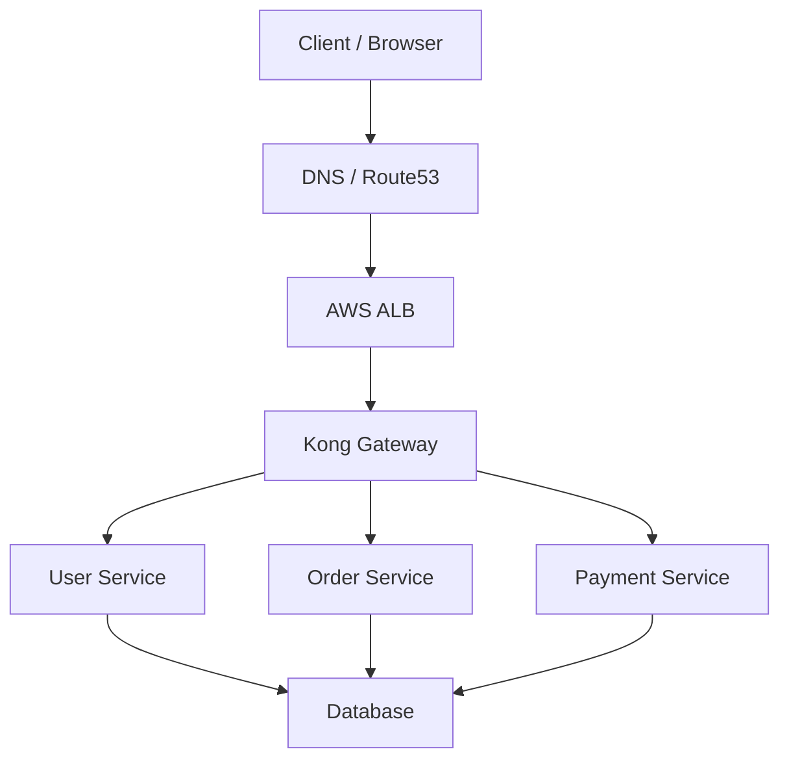
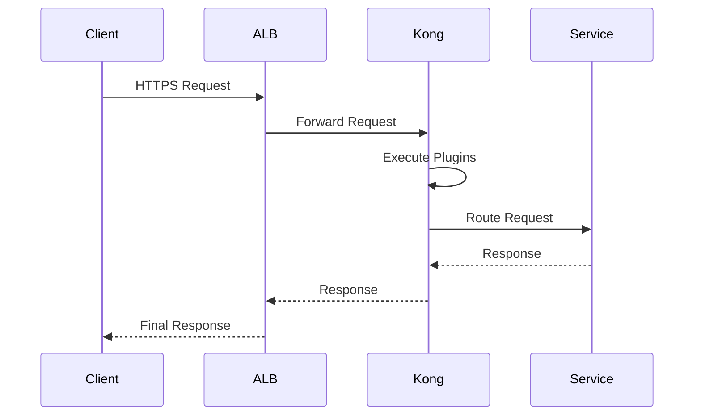

# KONG API GATEWAY — DETAILED DOCUMENTATION

<details>
<summary>Table of Contents</summary>

1. Introduction
2. Objective
3. What is Kong?
4. Why API Gateway is Required
5. Problems Without API Gateway
6. Evolution of Microservices and API Gateways
7. Core Concepts of Kong
8. Kong Architecture
9. Kong Internal Working
10. Kong Components
11. Kong Deployment Modes
12. Kong with Kubernetes
13. Kong with AWS ALB
14. Request Lifecycle in Kong
15. Kong Plugins
16. Security Features
17. Service Discovery in Kong
18. Kong Routing Mechanism
19. Kong vs Other API Gateways
20. Why We Are Choosing Kong
21. Advantages & Disadvantages
22. Best Practices
23. Production Architecture
24. Monitoring & Observability
25. FAQs
26. Contact Information
27. References

</details>

---

# 1. Introduction

Modern applications are increasingly built using microservices architecture, where applications are divided into smaller independently deployable services.

As the number of services increases, managing:

* authentication
* routing
* logging
* rate limiting
* SSL termination
* observability
* service discovery

becomes difficult.

This is where an API Gateway becomes essential.

Kong is one of the most widely adopted cloud-native API gateways designed for scalability, security, and high performance.

---

# 2. Objective

This documentation explains:

* What Kong is
* Why API gateways are needed
* How Kong works internally
* Kong architecture
* Kong integration with Kubernetes
* Kong integration with AWS ALB
* Kong comparison with other gateways
* Why Kong is selected for modern microservice environments

---

# 3. What is Kong?

Kong is an open-source API Gateway built on top of Nginx.

It acts as a centralized entry point between clients and backend services.

Kong processes incoming requests before forwarding them to backend microservices.

---

# Basic Kong Flow

```txt id="9l6e42"
Client
   ↓
Kong Gateway
   ↓
Microservices
```

Kong provides:

* API routing
* Authentication
* Authorization
* SSL/TLS
* Rate limiting
* Logging
* Monitoring
* Traffic control

---

# 4. Why API Gateway is Required

In microservices architecture, clients directly calling services creates operational complexity.

---

# Without API Gateway

```txt id="24emri"
Client → User Service
Client → Payment Service
Client → Order Service
Client → Inventory Service
```

Problems:

| Problem               | Description                      |
| --------------------- | -------------------------------- |
| Multiple Endpoints    | Clients manage many service URLs |
| Security Duplication  | Each service implements auth     |
| No Central Governance | Policies become inconsistent     |
| Monitoring Difficulty | Hard to trace requests           |
| Scaling Complexity    | Hard to manage traffic           |

---

# With API Gateway

```txt id="jjw4yo"
Client
   ↓
Kong Gateway
   ↓
Microservices
```

Benefits:

| Benefit              | Description        |
| -------------------- | ------------------ |
| Centralized Security | One place for auth |
| Unified Routing      | Single endpoint    |
| Observability        | Easier monitoring  |
| Traffic Control      | Rate limiting      |
| Simplified Clients   | One API endpoint   |

---

# 5. Problems Without API Gateway

## Security Issues

Every service manages:

* JWT validation
* API keys
* SSL

This causes inconsistency.

---

## Operational Complexity

As services increase:

* DNS management becomes difficult
* Routing logic spreads across services

---

## Monitoring Challenges

Without centralized gateway:

* distributed logging becomes difficult
* request tracing becomes hard

---

# 6. Evolution of Microservices and API Gateways

Traditional monolithic applications:

```txt id="d57j3w"
Client → Monolith Application
```

Modern microservices:

```txt id="m9t4yl"
Client → API Gateway → Services
```

API gateways became essential for:

* centralized traffic management
* service abstraction
* scalability

---

# 7. Core Concepts of Kong

| Concept  | Description             |
| -------- | ----------------------- |
| Service  | Backend microservice    |
| Route    | API path mapping        |
| Plugin   | Feature extension       |
| Consumer | API client/user         |
| Upstream | Load-balanced services  |
| Target   | Actual backend instance |

---

# 8. Kong Architecture

# High-Level Architecture



---

# 9. Kong Internal Working

Kong is built on:

* Nginx
* OpenResty
* Lua

Kong intercepts requests and processes them through a plugin execution pipeline.

---

# Request Processing Flow

```txt id="znd1zj"
Incoming Request
       ↓
Authentication
       ↓
Authorization
       ↓
Rate Limiting
       ↓
Routing
       ↓
Upstream Service
```

---

# 10. Kong Components

## Kong Proxy

Handles external traffic.

Default ports:

| Port | Purpose |
| ---- | ------- |
| 8000 | HTTP    |
| 8443 | HTTPS   |

---

## Admin API

Used for Kong configuration.

| Port | Purpose   |
| ---- | --------- |
| 8001 | Admin API |

Should remain private.

---

## Routes

Define API paths.

Example:

```txt id="ck97e3"
/users
/orders
/payments
```

---

## Services

Backend microservices.

Example:

```txt id="o6exbe"
user-service.default.svc.cluster.local
```

---

## Plugins

Extend Kong capabilities.

Examples:

* JWT auth
* Rate limiting
* Logging
* CORS

---

# 11. Kong Deployment Modes

## DB Mode

Uses PostgreSQL.

```txt id="um18jw"
Kong ↔ PostgreSQL
```

Advantages:

* centralized config
* dynamic changes

---

## DB-less Mode

Configuration via YAML.

Advantages:

* simpler
* lightweight
* GitOps-friendly

---

# 12. Kong with Kubernetes

Kong integrates with Kubernetes using:

* Ingress Controller
* CRDs
* Services
* Ingress resources

---

# Kubernetes Flow

```txt id="3n2b3g"
Client
   ↓
Kong Ingress
   ↓
Kubernetes Service
   ↓
Pods
```

---

# Example Kubernetes DNS

```txt id="ozqjdo"
user-service.default.svc.cluster.local
```

Kong routes internally using this DNS.

---

# 13. Kong with AWS ALB

Production environments commonly use:

```txt id="5uqnyj"
Internet
   ↓
AWS ALB
   ↓
Kong
   ↓
Microservices
```

---

# Why ALB is Used

| ALB Responsibility | Kong Responsibility |
| ------------------ | ------------------- |
| Public traffic     | API routing         |
| SSL certificates   | Authentication      |
| AWS WAF            | Rate limiting       |
| Internet exposure  | API governance      |

---

# 14. Request Lifecycle in Kong



---

# 15. Kong Plugins

Plugins provide extensibility.

---

# Common Plugins

| Plugin        | Purpose               |
| ------------- | --------------------- |
| JWT           | Authentication        |
| Key Auth      | API key validation    |
| Rate Limiting | Prevent abuse         |
| Prometheus    | Metrics               |
| CORS          | Cross-origin requests |
| Logging       | Centralized logs      |

---

# 16. Security Features

| Feature        | Description          |
| -------------- | -------------------- |
| SSL/TLS        | HTTPS encryption     |
| JWT Auth       | Token validation     |
| OAuth2         | Secure authorization |
| ACL            | Access control       |
| Rate Limiting  | DDoS protection      |
| IP Restriction | Allow/block IPs      |

---

# 17. Service Discovery in Kong

Kong supports:

* Kubernetes DNS
* Consul
* Eureka
* Static upstreams

---

# Kubernetes Example

```txt id="mg93t7"
orders-service.default.svc.cluster.local
```

---

# 18. Kong Routing Mechanism

Kong routes requests based on:

| Type   | Example           |
| ------ | ----------------- |
| Path   | `/users`          |
| Host   | `api.company.com` |
| Header | `x-region=india`  |
| Method | `GET`, `POST`     |

---

# 19. Kong vs Other API Gateways

| Feature           | Kong      | AWS API Gateway | Traefik   | NGINX    |
| ----------------- | --------- | --------------- | --------- | -------- |
| Open Source       | Yes       | No              | Yes       | Partial  |
| Kubernetes Native | Excellent | Moderate        | Excellent | Moderate |
| Plugins           | Strong    | Moderate        | Moderate  | Limited  |
| Performance       | High      | Moderate        | High      | High     |
| Self Hosted       | Yes       | No              | Yes       | Yes      |
| DB-less           | Yes       | No              | Yes       | No       |

---

# 20. Why We Are Choosing Kong

## Technical Reasons

* Kubernetes native
* Lightweight
* High performance
* Strong plugin ecosystem
* DB-less support
* Excellent ingress integration

---

## Business Reasons

* Open-source
* Cost-effective
* Easy scaling
* Faster onboarding
* Strong community support

---

# 21. Advantages & Disadvantages

| Advantages       | Disadvantages            |
| ---------------- | ------------------------ |
| High throughput  | Learning curve           |
| Strong ecosystem | Plugin complexity        |
| Open-source      | Enterprise features paid |
| Flexible routing | Initial setup effort     |

---

# 22. Best Practices

| Best Practice          | Recommendation        |
| ---------------------- | --------------------- |
| Keep Admin API Private | Never expose publicly |
| Enable HTTPS           | Always use TLS        |
| Use Rate Limiting      | Prevent abuse         |
| Use Monitoring         | Prometheus/Grafana    |
| Use GitOps             | Declarative configs   |

---

# 23. Production Architecture

```txt id="mlmcck"
Internet
   ↓
CloudFront
   ↓
AWS ALB
   ↓
Kong Gateway
   ↓
Microservices
   ↓
Databases
```

---

# 24. Monitoring & Observability

Recommended stack:

| Tool       | Purpose    |
| ---------- | ---------- |
| Prometheus | Metrics    |
| Grafana    | Dashboards |
| Loki       | Logs       |
| Jaeger     | Tracing    |

---

# 25. FAQs

| Question                      | Answer           |
| ----------------------------- | ---------------- |
| Is Kong free?                 | Yes, OSS version |
| Does Kong support Kubernetes? | Yes              |
| Is ALB mandatory?             | No               |
| Can Kong work without DB?     | Yes              |
| Does Kong support JWT?        | Yes              |
