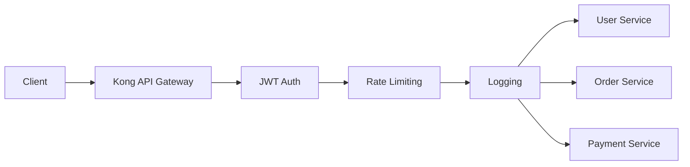

# Kong API Gateway — Real-World Microservices (E-Commerce System)


# 1. Overview

This project demonstrates a real-world microservices architecture using Kong API Gateway on Kubernetes.

The system simulates an E-Commerce Platform with:

- User Service
- Order Service
- Payment Service

Kong acts as a central API Gateway responsible for:

- Routing
- Authentication (JWT)
- Rate Limiting
- Logging & Observability


# 2. Objective

- Deploy microservices on Kubernetes (Minikube + EKS)
- Use Kong API Gateway
- Implement API Gateway plugins:
  - JWT Authentication
  - Rate Limiting
  - HTTP Logging
- Configure ingress-based routing
- Simulate production-grade architecture


# 3. Architecture

```mermaid
flowchart LR

Client["Client"]

Client --> Kong["Kong API Gateway"]

Kong --> JWT["JWT Plugin"]
JWT --> RateLimit["Rate Limiting Plugin"]
RateLimit --> Log["Logging Plugin"]

Log --> User["User Service"]
Log --> Order["Order Service"]
Log --> Payment["Payment Service"]
````

# 4. Prerequisites

| Tool     | Purpose                    |
| -------- | -------------------------- |
| Docker   | Container runtime          |
| kubectl  | Kubernetes CLI             |
| Minikube | Local Kubernetes cluster   |
| Helm     | Kubernetes package manager |


# 5. Kubernetes Cluster Setup


## Option 1 — Minikube (Local Setup)

⚠️ Note:
Minikube requires ~2GB RAM minimum. On small EC2 instances it may fail due to memory limits.

### Install Minikube

```bash
curl -LO https://storage.googleapis.com/minikube/releases/latest/minikube-linux-amd64
sudo install minikube-linux-amd64 /usr/local/bin/minikube
```

### Start Cluster

```bash
minikube start --driver=docker --memory=2500 --cpus=2
```

### Verify

```bash
kubectl get nodes
minikube status
```

---

### (Optional) Enable Ingress

```bash
minikube addons enable ingress
```

---

## Option 2 — AWS EKS (Production-Like)

```bash
eksctl create cluster \
  --name kong-cluster \
  --region ap-south-1 \
  --nodes 2
```

---

# 6. Install Kong API Gateway

```bash
helm repo add kong https://charts.konghq.com
helm repo update
```

```bash
helm install kong kong/kong \
  --namespace kong \
  --create-namespace \
  --set ingressController.installCRDs=false \
  --set proxy.type=NodePort
```

---

# 7. Project Structure

```bash
mkdir kong-ecommerce-poc
cd kong-ecommerce-poc
```

```bash
touch namespace.yaml user-service.yaml order-service.yaml payment-service.yaml kong-ingress.yaml
```

---

# 8. Kubernetes Manifests

---

## namespace.yaml

```yaml
apiVersion: v1
kind: Namespace
metadata:
  name: demo
```

## user-service.yaml

```yaml
apiVersion: apps/v1
kind: Deployment
metadata:
  name: user-service
  namespace: demo
spec:
  replicas: 2
  selector:
    matchLabels:
      app: user
  template:
    metadata:
      labels:
        app: user
    spec:
      containers:
      - name: user
        image: hashicorp/http-echo
        args:
        - "-text=User Service Working"
        ports:
        - containerPort: 5678
---
apiVersion: v1
kind: Service
metadata:
  name: user-service
  namespace: demo
spec:
  selector:
    app: user
  ports:
  - port: 80
    targetPort: 5678
```

## order-service.yaml

```yaml
apiVersion: apps/v1
kind: Deployment
metadata:
  name: order-service
  namespace: demo
spec:
  replicas: 2
  selector:
    matchLabels:
      app: order
  template:
    metadata:
      labels:
        app: order
    spec:
      containers:
      - name: order
        image: hashicorp/http-echo
        args:
        - "-text=Order Service Working"
        ports:
        - containerPort: 5678
---
apiVersion: v1
kind: Service
metadata:
  name: order-service
  namespace: demo
spec:
  selector:
    app: order
  ports:
  - port: 80
    targetPort: 5678
```

---

## payment-service.yaml

```yaml
apiVersion: apps/v1
kind: Deployment
metadata:
  name: payment-service
  namespace: demo
spec:
  replicas: 2
  selector:
    matchLabels:
      app: payment
  template:
    metadata:
      labels:
        app: payment
    spec:
      containers:
      - name: payment
        image: hashicorp/http-echo
        args:
        - "-text=Payment Service Working"
        ports:
        - containerPort: 5678
---
apiVersion: v1
kind: Service
metadata:
  name: payment-service
  namespace: demo
spec:
  selector:
    app: payment
  ports:
  - port: 80
    targetPort: 5678
```

# 9. Kong Plugins (REAL PRODUCTION FEATURES)

---

## JWT Plugin

```yaml
apiVersion: configuration.konghq.com/v1
kind: KongPlugin
metadata:
  name: jwt-auth
  namespace: demo
plugin: jwt
config:
  key_claim_name: iss
  claims_to_verify:
  - exp
```

---

## Rate Limiting Plugin

```yaml
apiVersion: configuration.konghq.com/v1
kind: KongPlugin
metadata:
  name: rate-limit
  namespace: demo
plugin: rate-limiting
config:
  minute: 5
  policy: local
```

---

## Logging Plugin

```yaml
apiVersion: configuration.konghq.com/v1
kind: KongPlugin
metadata:
  name: http-log
  namespace: demo
plugin: http-log
config:
  http_endpoint: http://mockbin.org/bin/log
  method: POST
  timeout: 1000
```

# 10. Kong Ingress (WITH PLUGINS)

```yaml
apiVersion: networking.k8s.io/v1
kind: Ingress
metadata:
  name: kong-ingress
  namespace: demo
  annotations:
    konghq.com/strip-path: "true"
    konghq.com/plugins: jwt-auth,rate-limit,http-log
spec:
  ingressClassName: kong
  rules:
  - http:
      paths:
      - path: /users
        pathType: Prefix
        backend:
          service:
            name: user-service
            port:
              number: 80

      - path: /orders
        pathType: Prefix
        backend:
          service:
            name: order-service
            port:
              number: 80

      - path: /payments
        pathType: Prefix
        backend:
          service:
            name: payment-service
            port:
              number: 80
```

# 11. Deploy Everything

```bash
kubectl apply -f namespace.yaml
kubectl apply -f user-service.yaml
kubectl apply -f order-service.yaml
kubectl apply -f payment-service.yaml
kubectl apply -f kong-ingress.yaml
```

# 12. Verify

```bash
kubectl get pods -n demo
kubectl get svc -n demo
kubectl get ingress -n demo
```

---

# 13. Test APIs

```bash
minikube service kong-kong-proxy -n kong
```

Then:

```bash
curl http://127.0.0.1:54321/users
curl http://127.0.0.1:54321/orders
curl http://127.0.0.1:54321/payments
```

# 14. AWS EKS Setup

```bash
eksctl create cluster \
  --name kong-cluster \
  --region ap-south-1 \
  --nodes 2
```

# 15. Architecture



# 16. Cleanup

```bash
kubectl delete -f kong-ingress.yaml
kubectl delete -f user-service.yaml
kubectl delete -f order-service.yaml
kubectl delete -f payment-service.yaml
kubectl delete namespace demo
helm uninstall kong -n kong
minikube stop
```
