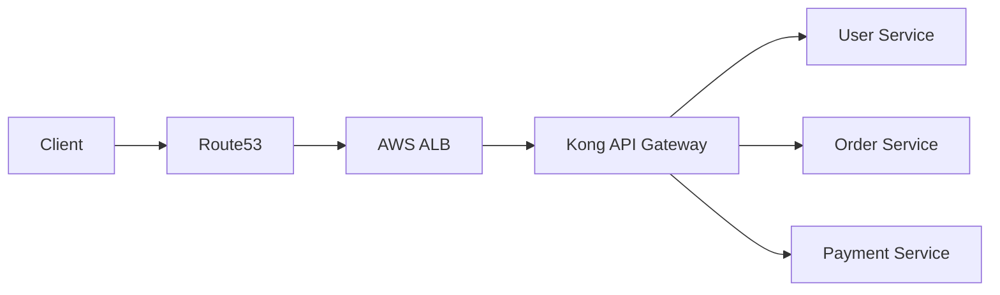

# Kong API Gateway — Real-World Microservices (E-Commerce System)


# 1. Overview

This project demonstrates a real-world microservices architecture using Kong API Gateway on Kubernetes.

The system simulates an E-Commerce Platform with:

- User Service
- Order Service
- Payment Service

Kong acts as the central API Gateway responsible for routing all incoming traffic to backend microservices.

# 2. Objective

- Deploy microservices on Kubernetes
- Use Kong API Gateway
- Configure ingress-based routing
- Simulate production-grade architecture
- Demonstrate Minikube and AWS EKS setups
- Understand API Gateway architecture

# 3. Architecture

```mermaid
flowchart LR

Client["Client / Browser / Mobile App"]

Client --> Kong["Kong API Gateway"]

Kong --> User["User Service"]
Kong --> Order["Order Service"]
Kong --> Payment["Payment Service"]

Order --> DB1[(Order DB)]
User --> DB2[(User DB)]
Payment --> DB3[(Payment DB)]
````

# 4. Prerequisites

## Required Tools

| Tool               | Purpose                    |
| ------------------ | -------------------------- |
| Docker             | Container Runtime          |
| kubectl            | Kubernetes CLI             |
| Minikube           | Local Kubernetes Cluster   |
| Helm               | Kubernetes Package Manager |
| AWS CLI (Optional) | AWS Access                 |
| eksctl (Optional)  | EKS Cluster Setup          |

# 5. Verify Installation

## Docker

```bash
docker --version
```

## kubectl

```bash
kubectl version --client
```

## Minikube

```bash
minikube version
```

## Helm

```bash
helm version
```

# 6. Kubernetes Cluster Setup

# Option 1 — Minikube (Recommended for Local)

## Start Minikube

```bash
minikube start --driver=docker
```

## Enable NGINX Ingress

```bash
minikube addons enable ingress
```

## Verify

```bash
kubectl get pods -n ingress-nginx
```

# Option 2 — AWS EKS (Production-Like)

```bash
eksctl create cluster \
  --name kong-cluster \
  --region ap-south-1 \
  --nodes 2
```

---

# 7. Install Kong API Gateway

## Add Kong Helm Repository

```bash
helm repo add kong https://charts.konghq.com
helm repo update
```

---

# Install Kong on Minikube

```bash
helm install kong kong/kong \
  --namespace kong \
  --create-namespace \
  --set ingressController.installCRDs=false \
  --set proxy.type=NodePort
```

# Verify Kong Installation

```bash
kubectl get pods -n kong
```

```bash
kubectl get svc -n kong
```

Expected services:

* kong-kong-proxy
* kong-controller
* kong-kong-manager


# 8. Project Structure

## Create Project Folder

```bash
mkdir kong-ecommerce-poc
cd kong-ecommerce-poc
```

# Create YAML Files

```bash
touch namespace.yaml \
user-service.yaml \
order-service.yaml \
payment-service.yaml \
kong-ingress.yaml \
alb-ingress.yaml
```
# Final Structure

```txt
kong-ecommerce-poc/
├── namespace.yaml
├── user-service.yaml
├── order-service.yaml
├── payment-service.yaml
├── kong-ingress.yaml
├── alb-ingress.yaml
```

---

# 9. Kubernetes Manifests

# namespace.yaml

```yaml
apiVersion: v1
kind: Namespace
metadata:
  name: demo
```

---

# user-service.yaml

```yaml
apiVersion: apps/v1
kind: Deployment
metadata:
  name: user-service
  namespace: demo

spec:
  replicas: 2

  selector:
    matchLabels:
      app: user

  template:
    metadata:
      labels:
        app: user

    spec:
      containers:
      - name: user
        image: hashicorp/http-echo

        args:
        - "-text=User Service Working"

        ports:
        - containerPort: 5678

---
apiVersion: v1
kind: Service

metadata:
  name: user-service
  namespace: demo

spec:
  selector:
    app: user

  ports:
  - port: 80
    targetPort: 5678
```

---

# order-service.yaml

```yaml
apiVersion: apps/v1
kind: Deployment
metadata:
  name: order-service
  namespace: demo

spec:
  replicas: 2

  selector:
    matchLabels:
      app: order

  template:
    metadata:
      labels:
        app: order

    spec:
      containers:
      - name: order
        image: hashicorp/http-echo

        args:
        - "-text=Order Service Working"

        ports:
        - containerPort: 5678

---
apiVersion: v1
kind: Service

metadata:
  name: order-service
  namespace: demo

spec:
  selector:
    app: order

  ports:
  - port: 80
    targetPort: 5678
```

---

# payment-service.yaml

```yaml
apiVersion: apps/v1
kind: Deployment
metadata:
  name: payment-service
  namespace: demo

spec:
  replicas: 2

  selector:
    matchLabels:
      app: payment

  template:
    metadata:
      labels:
        app: payment

    spec:
      containers:
      - name: payment
        image: hashicorp/http-echo

        args:
        - "-text=Payment Service Working"

        ports:
        - containerPort: 5678

---
apiVersion: v1
kind: Service

metadata:
  name: payment-service
  namespace: demo

spec:
  selector:
    app: payment

  ports:
  - port: 80
    targetPort: 5678
```

---

# kong-ingress.yaml

```yaml
apiVersion: networking.k8s.io/v1
kind: Ingress

metadata:
  name: kong-ingress
  namespace: demo

  annotations:
    konghq.com/strip-path: "true"

spec:
  ingressClassName: kong

  rules:
  - http:
      paths:

      - path: /users
        pathType: Prefix

        backend:
          service:
            name: user-service
            port:
              number: 80

      - path: /orders
        pathType: Prefix

        backend:
          service:
            name: order-service
            port:
              number: 80

      - path: /payments
        pathType: Prefix

        backend:
          service:
            name: payment-service
            port:
              number: 80
```

---

# alb-ingress.yaml (AWS ONLY)

```yaml
apiVersion: networking.k8s.io/v1
kind: Ingress

metadata:
  name: aws-alb-ingress
  namespace: demo

  annotations:
    kubernetes.io/ingress.class: alb
    alb.ingress.kubernetes.io/scheme: internet-facing

spec:
  rules:
  - http:
      paths:

      - path: /users
        pathType: Prefix

        backend:
          service:
            name: user-service
            port:
              number: 80

      - path: /orders
        pathType: Prefix

        backend:
          service:
            name: order-service
            port:
              number: 80

      - path: /payments
        pathType: Prefix

        backend:
          service:
            name: payment-service
            port:
              number: 80
```

# 10. Deploy Application

## Apply Namespace

```bash
kubectl apply -f namespace.yaml
```

## Deploy Services

```bash
kubectl apply -f user-service.yaml
kubectl apply -f order-service.yaml
kubectl apply -f payment-service.yaml
```

## Apply Kong Ingress

```bash
kubectl apply -f kong-ingress.yaml
```

# 11. Verify Deployment

## Check Pods

```bash
kubectl get pods -n demo
```

## Check Services

```bash
kubectl get svc -n demo
```

## Check Ingress

```bash
kubectl get ingress -n demo
```

# 12. Access APIs

# Minikube

Get Kong Proxy URL:

```bash
minikube service kong-kong-proxy -n kong
```

Example Output:

```txt
http://127.0.0.1:54321
```

# 13. Test APIs

# User Service

```bash
curl http://127.0.0.1:54321/users
```

Expected Response:

```txt
User Service Working
```

# Order Service

```bash
curl http://127.0.0.1:54321/orders
```

Expected Response:

```txt
Order Service Working
```

---

# Payment Service

```bash
curl http://127.0.0.1:54321/payments
```

Expected Response:

```txt
Payment Service Working
```

# 14. AWS ALB Setup (Optional)

## Install AWS Load Balancer Controller

```bash
helm repo add eks https://aws.github.io/eks-charts
helm repo update
```

```bash
helm install aws-load-balancer-controller eks/aws-load-balancer-controller \
  -n kube-system
```

# Apply ALB Ingress

```bash
kubectl apply -f alb-ingress.yaml
```

# 15. AWS Production Architecture



# 16. Troubleshooting

# Error: 404 Not Found

Reapply ingress:

```bash
kubectl apply -f kong-ingress.yaml
```

# Error: Connection Refused

Restart Kong proxy:

```bash
minikube service kong-kong-proxy -n kong
```

---

# Error: No Endpoints Available

Check pods:

```bash
kubectl get pods -n demo
```

# 17. Cleanup

## Delete Kubernetes Resources

```bash
kubectl delete -f kong-ingress.yaml

kubectl delete -f user-service.yaml
kubectl delete -f order-service.yaml
kubectl delete -f payment-service.yaml

kubectl delete namespace demo
```

# Remove Kong

```bash
helm uninstall kong -n kong
```

# Stop Minikube

```bash
minikube stop
```

# Delete EKS Cluster (If Used)

```bash
eksctl delete cluster \
  --name kong-cluster \
  --region ap-south-1
```
