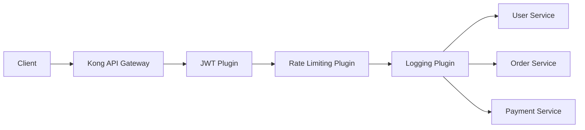

# Kong API Gateway — Real-World Microservices (E-Commerce System)


# 1. Overview

This project demonstrates a real-world microservices architecture using Kong API Gateway.

The system simulates an E-Commerce Platform with:

- User Service
- Order Service
- Payment Service

Kong acts as a central API Gateway responsible for:

- Routing
- Authentication (JWT)
- Rate Limiting
- Logging & Observability

# 2. Objective

- Deploy microservices using three different approaches (Local Bare Metal, Minikube, EKS)
- Run Kong in two database modes: **DB-less** and **PostgreSQL**
- Implement API Gateway plugins:
  - JWT Authentication
  - Rate Limiting
  - HTTP Logging
- Simulate production-grade architecture

# 3. Architecture



---

# 4. DB-less vs PostgreSQL — Which to Choose?

| Feature | DB-less Mode | PostgreSQL Mode |
| ------- | ------------ | --------------- |
| Database required | No | Yes (PostgreSQL 12+) |
| Config style | Declarative YAML file (`kong.yml`) | Admin API or DB entries |
| Dynamic config changes | Reload required | Instant via Admin API |
| Persistence | Config file on disk | Database |
| Best for | Simple setups, GitOps, CI/CD | Production, dynamic routing |
| Admin API writes | Read-only | Full read/write |
| Plugins | Defined in YAML | Applied via Admin API |

---

# 5. Setup Options — Choose Your Environment

| Option | Tools Required | Best For |
| ------ | -------------- | -------- |
| **Option A** — Local Bare Metal | Ubuntu + curl only | EC2, VMs, no k8s |
| **Option B** — Minikube | Docker, kubectl, Minikube, Helm | Local Kubernetes |
| **Option C** — AWS EKS | eksctl, kubectl, Helm, AWS CLI | Production |

---

# 6. Option A — Local Setup (No Docker, No Helm, No Kubernetes)

---

## 6.1 Install Kong

```bash
curl -Lo kong.deb "https://packages.konghq.com/public/gateway-39/deb/ubuntu/pool/noble/main/k/ko/kong_3.9.0/kong_3.9.0_amd64.deb"
sudo dpkg -i --force-depends kong.deb
kong version
# 3.9.0
sudo apt-mark hold kong
```

> ⚠️ Ubuntu 25.10 dropped `libpcre3`. The `--force-depends` flag bypasses this unresolvable
> dependency — Kong works fine at runtime without it.

---

## 6.2 Option A1 — DB-less Mode (No Database)

### Configure Kong

```bash
sudo tee /etc/kong/kong.conf <<'EOF'
database = off
declarative_config = /etc/kong/kong.yml
proxy_listen = 0.0.0.0:8000
admin_listen = 127.0.0.1:8001
EOF
```

### Create Declarative Config

Replace `<HOST>` with your backend IP or hostname:

```bash
sudo tee /etc/kong/kong.yml <<'EOF'
_format_version: "3.0"
_transform: true

services:
  - name: user-service
    url: http://<HOST>:5678
    plugins:
      - name: rate-limiting
        config:
          minute: 5
          policy: local
      - name: jwt
        config:
          key_claim_name: iss
          claims_to_verify:
            - exp
    routes:
      - name: user-route
        paths:
          - /users
        strip_path: true

  - name: order-service
    url: http://<HOST>:5678
    plugins:
      - name: rate-limiting
        config:
          minute: 5
          policy: local
    routes:
      - name: order-route
        paths:
          - /orders
        strip_path: true

  - name: payment-service
    url: http://<HOST>:5678
    plugins:
      - name: http-log
        config:
          http_endpoint: http://mockbin.org/bin/log
          method: POST
          timeout: 1000
    routes:
      - name: payment-route
        paths:
          - /payments
        strip_path: true
EOF
```

### Start Kong

```bash
sudo kong check /etc/kong/kong.conf
sudo kong start -c /etc/kong/kong.conf
```

### Reload After Config Changes

```bash
sudo kong reload -c /etc/kong/kong.conf
```

---

## 6.3 Option A2 — PostgreSQL Mode (With Database)

### Install PostgreSQL

```bash
sudo apt update
sudo apt install -y postgresql postgresql-contrib
sudo systemctl start postgresql
sudo systemctl enable postgresql
```

### Create Kong Database and User

```bash
sudo -u postgres psql <<'EOF'
CREATE USER kong WITH PASSWORD 'kong';
CREATE DATABASE kong OWNER kong;
GRANT ALL PRIVILEGES ON DATABASE kong TO kong;
EOF
```

### Configure Kong to Use PostgreSQL

```bash
sudo tee /etc/kong/kong.conf <<'EOF'
database = postgres
pg_host = 127.0.0.1
pg_port = 5432
pg_database = kong
pg_user = kong
pg_password = kong

proxy_listen = 0.0.0.0:8000
admin_listen = 127.0.0.1:8001
EOF
```

### Run Database Migrations

```bash
sudo kong migrations bootstrap -c /etc/kong/kong.conf
```

Expected output:

```
Migrating core... OK
Migrating rate-limiting... OK
Database is up-to-date
```

### Start Kong

```bash
sudo kong start -c /etc/kong/kong.conf
```

### Add Services and Routes via Admin API

With PostgreSQL mode, config is applied dynamically through the Admin API — no YAML file needed.

**Add User Service:**

```bash
curl -i -X POST http://localhost:8001/services \
  --data name=user-service \
  --data url=http://<HOST>:5678

curl -i -X POST http://localhost:8001/services/user-service/routes \
  --data "paths[]=/users" \
  --data strip_path=true
```

**Add Order Service:**

```bash
curl -i -X POST http://localhost:8001/services \
  --data name=order-service \
  --data url=http://<HOST>:5678

curl -i -X POST http://localhost:8001/services/order-service/routes \
  --data "paths[]=/orders" \
  --data strip_path=true
```

**Add Payment Service:**

```bash
curl -i -X POST http://localhost:8001/services \
  --data name=payment-service \
  --data url=http://<HOST>:5678

curl -i -X POST http://localhost:8001/services/payment-service/routes \
  --data "paths[]=/payments" \
  --data strip_path=true
```

### Add Plugins via Admin API

**Rate Limiting on User Service:**

```bash
curl -i -X POST http://localhost:8001/services/user-service/plugins \
  --data name=rate-limiting \
  --data config.minute=5 \
  --data config.policy=local
```

**JWT on Order Service:**

```bash
curl -i -X POST http://localhost:8001/services/order-service/plugins \
  --data name=jwt \
  --data config.key_claim_name=iss \
  --data "config.claims_to_verify[]=exp"
```

**HTTP Logging on Payment Service:**

```bash
curl -i -X POST http://localhost:8001/services/payment-service/plugins \
  --data name=http-log \
  --data config.http_endpoint=http://mockbin.org/bin/log \
  --data config.method=POST \
  --data config.timeout=1000
```

### Verify Config is Stored in DB

```bash
curl -s http://localhost:8001/services | python3 -m json.tool
curl -s http://localhost:8001/routes | python3 -m json.tool
curl -s http://localhost:8001/plugins | python3 -m json.tool
```

---

## 6.4 Verify Kong is Running (Both Modes)

```bash
# Proxy port
curl -s http://localhost:8000/users

# Admin API version check
curl -s http://localhost:8001 | python3 -m json.tool | grep '"version"'
```

---

## 6.5 Auto-start on Reboot (systemd)

```bash
sudo tee /etc/systemd/system/kong.service <<'EOF'
[Unit]
Description=Kong API Gateway
After=network.target postgresql.service

[Service]
Type=forking
User=root
ExecStart=/usr/local/bin/kong start -c /etc/kong/kong.conf
ExecReload=/usr/local/bin/kong reload -c /etc/kong/kong.conf
ExecStop=/usr/local/bin/kong stop
Restart=on-failure

[Install]
WantedBy=multi-user.target
EOF

sudo systemctl daemon-reload
sudo systemctl enable kong
sudo systemctl start kong
```

---

## 6.6 File Structure (Local Setup)

```
/etc/kong/
├── kong.conf          ← Kong runtime configuration
└── kong.yml           ← Declarative config (DB-less only)

/usr/local/bin/
└── kong               ← Kong binary

/usr/local/kong/logs/
├── access.log
└── error.log
```

---

## 6.7 Ports Reference

| Port | Purpose |
| ---- | ------- |
| `8000` | Proxy — HTTP API traffic |
| `8001` | Admin API — management |
| `8443` | Proxy — HTTPS |
| `8444` | Admin API — HTTPS |

---

## 6.8 Cleanup (Local Setup)

```bash
# Stop Kong
sudo kong stop
sudo systemctl disable kong
sudo rm /etc/systemd/system/kong.service

# Remove Kong
sudo dpkg -r kong
sudo apt-mark unhold kong
sudo rm -rf /etc/kong

# Remove PostgreSQL (if used)
sudo apt remove --purge -y postgresql postgresql-contrib
sudo -u postgres psql -c "DROP DATABASE kong;" 2>/dev/null || true
sudo -u postgres psql -c "DROP USER kong;" 2>/dev/null || true
```

# 7. Option B — Minikube (Local Kubernetes)

> ⚠️ Minikube requires ~2GB RAM minimum. Use t3.medium or larger on EC2.

---

## 7.1 Prerequisites

| Tool     | Purpose                        |
| -------- | ------------------------------ |
| Docker   | Container runtime for Minikube |
| kubectl  | Kubernetes CLI                 |
| Minikube | Local Kubernetes cluster       |
| Helm     | Kubernetes package manager     |

---

## 7.2 Install Minikube and Start Cluster

```bash
curl -LO https://storage.googleapis.com/minikube/releases/latest/minikube-linux-amd64
sudo install minikube-linux-amd64 /usr/local/bin/minikube

minikube start --driver=docker --memory=2500 --cpus=2

kubectl get nodes
minikube status
```

### (Optional) Enable Ingress

```bash
minikube addons enable ingress
```

## 7.3 Option B1 — DB-less Mode (No Database)

### Install Kong via Helm (DB-less)

```bash
helm repo add kong https://charts.konghq.com
helm repo update

helm install kong kong/kong \
  --namespace kong \
  --create-namespace \
  --set ingressController.installCRDs=false \
  --set proxy.type=NodePort \
  --set env.database=off \
  --set env.declarative_config=/kong_dbless/kong.yml
```

### Project Structure

```bash
mkdir kong-ecommerce-poc
cd kong-ecommerce-poc
touch namespace.yaml user-service.yaml order-service.yaml payment-service.yaml \
      kong-dbless-config.yaml kong-ingress.yaml
```

### kong-dbless-config.yaml (ConfigMap)

```yaml
apiVersion: v1
kind: ConfigMap
metadata:
  name: kong-dbless-config
  namespace: kong
data:
  kong.yml: |
    _format_version: "3.0"
    _transform: true

    services:
      - name: user-service
        url: http://user-service.demo.svc.cluster.local:80
        plugins:
          - name: rate-limiting
            config:
              minute: 5
              policy: local
        routes:
          - name: user-route
            paths:
              - /users
            strip_path: true

      - name: order-service
        url: http://order-service.demo.svc.cluster.local:80
        plugins:
          - name: jwt
            config:
              key_claim_name: iss
              claims_to_verify:
                - exp
        routes:
          - name: order-route
            paths:
              - /orders
            strip_path: true

      - name: payment-service
        url: http://payment-service.demo.svc.cluster.local:80
        plugins:
          - name: http-log
            config:
              http_endpoint: http://mockbin.org/bin/log
              method: POST
              timeout: 1000
        routes:
          - name: payment-route
            paths:
              - /payments
            strip_path: true
```

Apply the ConfigMap and restart Kong to pick it up:

```bash
kubectl apply -f kong-dbless-config.yaml
kubectl rollout restart deployment/kong-kong -n kong
```

---

## 7.4 Option B2 — PostgreSQL Mode (With Database)

### Install PostgreSQL in Cluster

```bash
helm repo add bitnami https://charts.bitnami.com/bitnami
helm repo update

helm install kong-postgres bitnami/postgresql \
  --namespace kong \
  --create-namespace \
  --set auth.username=kong \
  --set auth.password=kong \
  --set auth.database=kong
```

Wait for PostgreSQL to be ready:

```bash
kubectl get pods -n kong -w
```

### Install Kong via Helm (PostgreSQL)

```bash
helm install kong kong/kong \
  --namespace kong \
  --set ingressController.installCRDs=false \
  --set proxy.type=NodePort \
  --set env.database=postgres \
  --set env.pg_host=kong-postgres-postgresql.kong.svc.cluster.local \
  --set env.pg_port=5432 \
  --set env.pg_database=kong \
  --set env.pg_user=kong \
  --set env.pg_password=kong \
  --set migrations.enabled=true
```

The `migrations.enabled=true` flag runs `kong migrations bootstrap` automatically as an
init container before Kong starts.

---

## 7.5 Kubernetes Manifests (Both B1 and B2)

### namespace.yaml

```yaml
apiVersion: v1
kind: Namespace
metadata:
  name: demo
```

### user-service.yaml

```yaml
apiVersion: apps/v1
kind: Deployment
metadata:
  name: user-service
  namespace: demo
spec:
  replicas: 2
  selector:
    matchLabels:
      app: user
  template:
    metadata:
      labels:
        app: user
    spec:
      containers:
      - name: user
        image: hashicorp/http-echo
        args:
        - "-text=User Service Working"
        ports:
        - containerPort: 5678
---
apiVersion: v1
kind: Service
metadata:
  name: user-service
  namespace: demo
spec:
  selector:
    app: user
  ports:
  - port: 80
    targetPort: 5678
```

### order-service.yaml

```yaml
apiVersion: apps/v1
kind: Deployment
metadata:
  name: order-service
  namespace: demo
spec:
  replicas: 2
  selector:
    matchLabels:
      app: order
  template:
    metadata:
      labels:
        app: order
    spec:
      containers:
      - name: order
        image: hashicorp/http-echo
        args:
        - "-text=Order Service Working"
        ports:
        - containerPort: 5678
---
apiVersion: v1
kind: Service
metadata:
  name: order-service
  namespace: demo
spec:
  selector:
    app: order
  ports:
  - port: 80
    targetPort: 5678
```

### payment-service.yaml

```yaml
apiVersion: apps/v1
kind: Deployment
metadata:
  name: payment-service
  namespace: demo
spec:
  replicas: 2
  selector:
    matchLabels:
      app: payment
  template:
    metadata:
      labels:
        app: payment
    spec:
      containers:
      - name: payment
        image: hashicorp/http-echo
        args:
        - "-text=Payment Service Working"
        ports:
        - containerPort: 5678
---
apiVersion: v1
kind: Service
metadata:
  name: payment-service
  namespace: demo
spec:
  selector:
    app: payment
  ports:
  - port: 80
    targetPort: 5678
```

---

## 7.6 Kong Plugins (KongPlugin CRDs — PostgreSQL Mode)

### JWT Plugin

```yaml
apiVersion: configuration.konghq.com/v1
kind: KongPlugin
metadata:
  name: jwt-auth
  namespace: demo
plugin: jwt
config:
  key_claim_name: iss
  claims_to_verify:
  - exp
```

### Rate Limiting Plugin

```yaml
apiVersion: configuration.konghq.com/v1
kind: KongPlugin
metadata:
  name: rate-limit
  namespace: demo
plugin: rate-limiting
config:
  minute: 5
  policy: local
```

### Logging Plugin

```yaml
apiVersion: configuration.konghq.com/v1
kind: KongPlugin
metadata:
  name: http-log
  namespace: demo
plugin: http-log
config:
  http_endpoint: http://mockbin.org/bin/log
  method: POST
  timeout: 1000
```

---

## 7.7 Kong Ingress (With Plugins)

```yaml
apiVersion: networking.k8s.io/v1
kind: Ingress
metadata:
  name: kong-ingress
  namespace: demo
  annotations:
    konghq.com/strip-path: "true"
    konghq.com/plugins: jwt-auth,rate-limit,http-log
spec:
  ingressClassName: kong
  rules:
  - http:
      paths:
      - path: /users
        pathType: Prefix
        backend:
          service:
            name: user-service
            port:
              number: 80
      - path: /orders
        pathType: Prefix
        backend:
          service:
            name: order-service
            port:
              number: 80
      - path: /payments
        pathType: Prefix
        backend:
          service:
            name: payment-service
            port:
              number: 80
```

## 7.8 Deploy Everything

```bash
kubectl apply -f namespace.yaml
kubectl apply -f user-service.yaml
kubectl apply -f order-service.yaml
kubectl apply -f payment-service.yaml
kubectl apply -f kong-ingress.yaml
```

## 7.9 Verify

```bash
kubectl get pods -n demo
kubectl get pods -n kong
kubectl get svc -n demo
kubectl get ingress -n demo
```

## 7.10 Test APIs

```bash
minikube service kong-kong-proxy -n kong
```

Replace port with the one Minikube assigns:

```bash
curl http://127.0.0.1:54321/users
curl http://127.0.0.1:54321/orders
curl http://127.0.0.1:54321/payments
```

---

## 7.11 Cleanup (Minikube)

```bash
kubectl delete -f kong-ingress.yaml
kubectl delete -f user-service.yaml
kubectl delete -f order-service.yaml
kubectl delete -f payment-service.yaml
kubectl delete namespace demo
helm uninstall kong -n kong
helm uninstall kong-postgres -n kong    # if PostgreSQL was installed
minikube stop
```
# 8. Option C — AWS EKS (Production)

## 8.1 Prerequisites

| Tool    | Purpose                         |
| ------- | ------------------------------- |
| eksctl  | EKS cluster provisioning CLI    |
| kubectl | Kubernetes CLI                  |
| Helm    | Kubernetes package manager      |
| AWS CLI | Configured with appropriate IAM |


## 8.2 Create EKS Cluster

```bash
eksctl create cluster \
  --name kong-cluster \
  --region ap-south-1 \
  --nodes 2
```

Takes approximately 15 minutes.

---

## 8.3 Option C1 — DB-less Mode on EKS

### Install Kong via Helm (DB-less)

```bash
helm repo add kong https://charts.konghq.com
helm repo update

helm install kong kong/kong \
  --namespace kong \
  --create-namespace \
  --set ingressController.installCRDs=false \
  --set proxy.type=LoadBalancer \
  --set env.database=off \
  --set env.declarative_config=/kong_dbless/kong.yml
```

### Create ConfigMap with Declarative Config

```bash
kubectl apply -f - <<'EOF'
apiVersion: v1
kind: ConfigMap
metadata:
  name: kong-dbless-config
  namespace: kong
data:
  kong.yml: |
    _format_version: "3.0"
    _transform: true

    services:
      - name: user-service
        url: http://user-service.demo.svc.cluster.local:80
        plugins:
          - name: rate-limiting
            config:
              minute: 5
              policy: local
        routes:
          - name: user-route
            paths:
              - /users
            strip_path: true

      - name: order-service
        url: http://order-service.demo.svc.cluster.local:80
        plugins:
          - name: jwt
            config:
              key_claim_name: iss
              claims_to_verify:
                - exp
        routes:
          - name: order-route
            paths:
              - /orders
            strip_path: true

      - name: payment-service
        url: http://payment-service.demo.svc.cluster.local:80
        plugins:
          - name: http-log
            config:
              http_endpoint: http://mockbin.org/bin/log
              method: POST
              timeout: 1000
        routes:
          - name: payment-route
            paths:
              - /payments
            strip_path: true
EOF

kubectl rollout restart deployment/kong-kong -n kong
```

---

## 8.4 Option C2 — PostgreSQL Mode on EKS

### Option 1 — PostgreSQL in Cluster (via Helm)

```bash
helm repo add bitnami https://charts.bitnami.com/bitnami
helm repo update

helm install kong-postgres bitnami/postgresql \
  --namespace kong \
  --set auth.username=kong \
  --set auth.password=kong \
  --set auth.database=kong
```

### Option 2 — AWS RDS PostgreSQL (Recommended for Production)

Provision an RDS instance in the same VPC as EKS, then use its endpoint:

```bash
# Replace <RDS-ENDPOINT> with your RDS instance endpoint
export PG_HOST=<RDS-ENDPOINT>
```

### Install Kong via Helm (PostgreSQL)

```bash
helm install kong kong/kong \
  --namespace kong \
  --create-namespace \
  --set ingressController.installCRDs=false \
  --set proxy.type=LoadBalancer \
  --set env.database=postgres \
  --set env.pg_host=$PG_HOST \
  --set env.pg_port=5432 \
  --set env.pg_database=kong \
  --set env.pg_user=kong \
  --set env.pg_password=kong \
  --set migrations.enabled=true
```

## 8.5 Deploy Microservices

Use the same manifests from Section 7.5 through 7.7:

```bash
kubectl apply -f namespace.yaml
kubectl apply -f user-service.yaml
kubectl apply -f order-service.yaml
kubectl apply -f payment-service.yaml
kubectl apply -f kong-ingress.yaml
```

---

## 8.6 Get the Load Balancer URL

```bash
kubectl get svc -n kong
```

Look for `EXTERNAL-IP` on the `kong-kong-proxy` service:

```
a1b2c3d4e5.ap-south-1.elb.amazonaws.com
```

## 8.7 Test APIs

```bash
export KONG_URL=http://<EXTERNAL-IP>

curl $KONG_URL/users
curl $KONG_URL/orders
curl $KONG_URL/payments
```

## 8.8 Cleanup (EKS)

```bash
kubectl delete -f kong-ingress.yaml
kubectl delete -f user-service.yaml
kubectl delete -f order-service.yaml
kubectl delete -f payment-service.yaml
kubectl delete namespace demo
helm uninstall kong -n kong
helm uninstall kong-postgres -n kong    # if in-cluster PostgreSQL was used
eksctl delete cluster --name kong-cluster --region ap-south-1
```

> ⚠️ Always delete the EKS cluster and RDS instance when done to avoid ongoing AWS charges.


# 9. Comparison — All Options

| Feature | A1 Local DB-less | A2 Local + PG | B1 Minikube DB-less | B2 Minikube + PG | C1 EKS DB-less | C2 EKS + PG |
| ------- | ---------------- | ------------- | ------------------- | ---------------- | -------------- | ----------- |
| Docker required | No | No | Yes | Yes | Yes | Yes |
| Kubernetes | No | No | Local | Local | Managed | Managed |
| Helm | No | No | Yes | Yes | Yes | Yes |
| Database | None | PostgreSQL | None | PostgreSQL | None | PG / RDS |
| Config style | YAML file | Admin API | ConfigMap | KongPlugin CRDs | ConfigMap | KongPlugin CRDs |
| Dynamic updates | Reload | Instant | Restart pod | Instant | Restart pod | Instant |
| Cost | Free | Free | Free | Free | AWS charges | AWS + RDS |
| Setup time | ~5 min | ~10 min | ~15 min | ~20 min | ~20 min | ~30 min |
| Best for | Quick testing | Local prod-like | Local k8s dev | Full k8s dev | Production | Enterprise |
