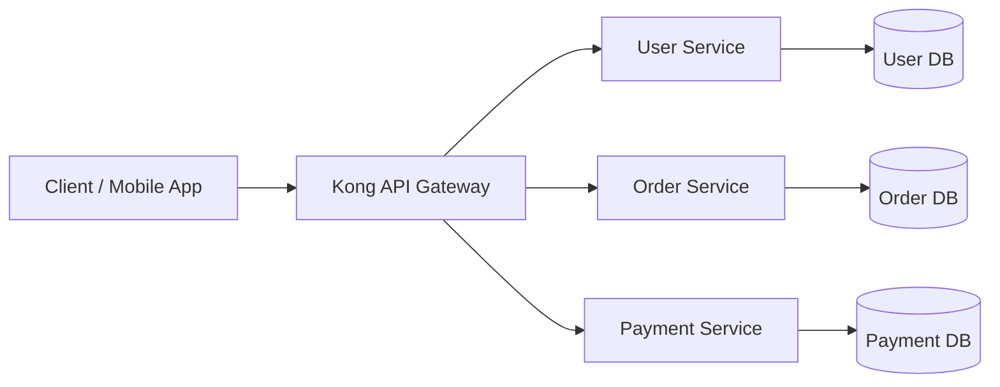
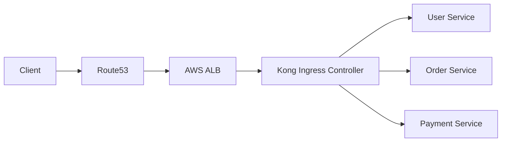

# Kong API Gateway — Real-World Microservices (E-Commerce System)


# 1. Overview

This POC demonstrates a **real-world microservices architecture using Kong API Gateway**, simulating an **E-Commerce system** with:

* User Service (Authentication/Profile)
* Order Service (Order Management)
* Payment Service (Payment Processing)

Kong acts as a **central API Gateway** responsible for routing all traffic.

# 2. Objective

* Deploy microservices on Kubernetes
* Use Kong as API Gateway
* Route traffic using ingress rules
* Simulate production-grade architecture
* Demonstrate ALB vs Non-ALB setups


# 3. Prerequisites

## Required Tools

| Tool               | Purpose                    | Install Link                                                                                                                               |
| ------------------ | -------------------------- | ------------------------------------------------------------------------------------------------------------------------------------------ |
| kubectl            | Kubernetes CLI             | [https://kubernetes.io/docs/tasks/tools/](https://kubernetes.io/docs/tasks/tools/)                                                         |
| Docker             | Container runtime          | [https://docs.docker.com/get-docker/](https://docs.docker.com/get-docker/)                                                                 |
| Helm               | Kubernetes package manager | [https://helm.sh/docs/intro/install/](https://helm.sh/docs/intro/install/)                                                                 |
| AWS CLI (optional) | AWS services               | [https://docs.aws.amazon.com/cli/latest/userguide/install-cliv2.html](https://docs.aws.amazon.com/cli/latest/userguide/install-cliv2.html) |
| eksctl (optional)  | EKS cluster setup          | [https://eksctl.io/](https://eksctl.io/)                                                                                                   |


## Verify Installation

```bash
kubectl version --client
helm version
docker version
```

# 4. Kubernetes Cluster Setup

## Option 1: Minikube (Local)

```bash
minikube start --driver=docker
minikube addons enable ingress
```

## Option 2: AWS EKS (Production-like)

```bash
eksctl create cluster \
  --name kong-cluster \
  --region ap-south-1 \
  --nodes 2
```

# 5. Install Kong API Gateway

```bash
helm repo add kong https://charts.konghq.com
helm repo update

helm install kong kong/kong \
  --namespace kong \
  --create-namespace
```

## Verify Installation

```bash
kubectl get pods -n kong
kubectl get svc -n kong
```

# 6. Folder Structure

```txt
kong-ecommerce-poc/
├── namespace.yaml
├── user-service.yaml
├── order-service.yaml
├── payment-service.yaml
├── kong-ingress.yaml
├── alb-ingress.yaml
```

# 7. Deploy Microservices

Good catch — that part is missing in most POCs and without it your README is not actually runnable.

Below is your **FINAL missing piece: complete folder creation + file generation commands + content mapping**, ready to paste.

---

# 6. Folder Structure 

## Create Project Folder

```bash id="mkroot"
mkdir kong-ecommerce-poc
cd kong-ecommerce-poc
```

## Create Files

```bash id="mkfiles"
touch namespace.yaml \
user-service.yaml \
order-service.yaml \
payment-service.yaml \
kong-ingress.yaml \
alb-ingress.yaml
```

## Final Structure

```txt id="finalstruct"
kong-ecommerce-poc/
├── namespace.yaml
├── user-service.yaml
├── order-service.yaml
├── payment-service.yaml
├── kong-ingress.yaml
├── alb-ingress.yaml
```

# namespace.yaml

```yaml id="nsfile"
apiVersion: v1
kind: Namespace
metadata:
  name: demo
```

# user-service.yaml

```yaml id="userfile"
apiVersion: apps/v1
kind: Deployment
metadata:
  name: user-service
  namespace: demo
spec:
  replicas: 2
  selector:
    matchLabels:
      app: user
  template:
    metadata:
      labels:
        app: user
    spec:
      containers:
      - name: user
        image: hashicorp/http-echo
        args:
        - "-text={\"service\":\"user\",\"api\":\"/profile\",\"status\":\"active\"}"
        ports:
        - containerPort: 5678
---
apiVersion: v1
kind: Service
metadata:
  name: user-service
  namespace: demo
spec:
  selector:
    app: user
  ports:
  - port: 80
    targetPort: 5678
```

# order-service.yaml

```yaml id="orderfile"
apiVersion: apps/v1
kind: Deployment
metadata:
  name: order-service
  namespace: demo
spec:
  replicas: 2
  selector:
    matchLabels:
      app: order
  template:
    metadata:
      labels:
        app: order
    spec:
      containers:
      - name: order
        image: hashicorp/http-echo
        args:
        - "-text={\"service\":\"order\",\"api\":\"/create-order\",\"status\":\"processing\"}"
        ports:
        - containerPort: 5678
---
apiVersion: v1
kind: Service
metadata:
  name: order-service
  namespace: demo
spec:
  selector:
    app: order
  ports:
  - port: 80
    targetPort: 5678
```

# payment-service.yaml

```yaml id="paymentfile"
apiVersion: apps/v1
kind: Deployment
metadata:
  name: payment-service
  namespace: demo
spec:
  replicas: 2
  selector:
    matchLabels:
      app: payment
  template:
    metadata:
      labels:
        app: payment
    spec:
      containers:
      - name: payment
        image: hashicorp/http-echo
        args:
        - "-text={\"service\":\"payment\",\"api\":\"/charge\",\"status\":\"success\"}"
        ports:
        - containerPort: 5678
---
apiVersion: v1
kind: Service
metadata:
  name: payment-service
  namespace: demo
spec:
  selector:
    app: payment
  ports:
  - port: 80
    targetPort: 5678
```

# kong-ingress.yaml

```yaml id="kongfile"
apiVersion: networking.k8s.io/v1
kind: Ingress
metadata:
  name: kong-ecommerce
  namespace: demo
  annotations:
    konghq.com/strip-path: "true"
spec:
  ingressClassName: kong
  rules:
  - http:
      paths:
      - path: /users
        pathType: Prefix
        backend:
          service:
            name: user-service
            port:
              number: 80

      - path: /orders
        pathType: Prefix
        backend:
          service:
            name: order-service
            port:
              number: 80

      - path: /payments
        pathType: Prefix
        backend:
          service:
            name: payment-service
            port:
              number: 80
```

# alb-ingress.yaml (AWS ONLY)

```yaml id="albfile"
apiVersion: networking.k8s.io/v1
kind: Ingress
metadata:
  name: aws-alb-ingress
  namespace: demo
  annotations:
    kubernetes.io/ingress.class: alb
    alb.ingress.kubernetes.io/scheme: internet-facing
spec:
  rules:
  - http:
      paths:
      - path: /users
        pathType: Prefix
        backend:
          service:
            name: user-service
            port:
              number: 80

      - path: /orders
        pathType: Prefix
        backend:
          service:
            name: order-service
            port:
              number: 80

      - path: /payments
        pathType: Prefix
        backend:
          service:
            name: payment-service
            port:
              number: 80
```

# FINAL USAGE FLOW (HOW TO RUN EVERYTHING)

## 1️ Create folder

```bash
mkdir kong-ecommerce-poc && cd kong-ecommerce-poc
```

## 2️ Create files

```bash
touch *.yaml
```

## 3️ Apply everything

```bash
kubectl apply -f namespace.yaml
kubectl apply -f user-service.yaml
kubectl apply -f order-service.yaml
kubectl apply -f payment-service.yaml
kubectl apply -f kong-ingress.yaml
```
## Verify

```bash
kubectl get pods -n demo
kubectl get svc -n demo
```

# 8. Kong Routing Configuration

```bash
kubectl apply -f kong-ingress.yaml
```

## Verify Ingress

```bash
kubectl get ingress -n demo
```

# 9. Optional — AWS ALB Setup

```bash
helm repo add eks https://aws.github.io/eks-charts
helm repo update

helm install aws-load-balancer-controller eks/aws-load-balancer-controller \
  -n kube-system
```

## Apply ALB Ingress

```bash
kubectl apply -f alb-ingress.yaml
```

# 10. Access APIs

## Get Kong External IP

### Minikube

```bash
minikube service kong-kong-proxy -n kong
```

### AWS EKS

```bash
kubectl get svc -n kong
```

## Test APIs

### User Service

```bash
curl http://<KONG-IP>/users
```

### 📦 Order Service

```bash
curl http://<KONG-IP>/orders
```

### Payment Service

```bash
curl http://<KONG-IP>/payments
```

# 11. Architecture Flow



# 12. AWS Production Flow (ALB + Kong)



# 13. Cleanup

## Remove Kubernetes resources

```bash
kubectl delete -f kong-ingress.yaml
kubectl delete -f user-service.yaml
kubectl delete -f order-service.yaml
kubectl delete -f payment-service.yaml
kubectl delete namespace demo
```

## Delete EKS Cluster (if used)

```bash
eksctl delete cluster --name kong-cluster --region ap-south-1
```
