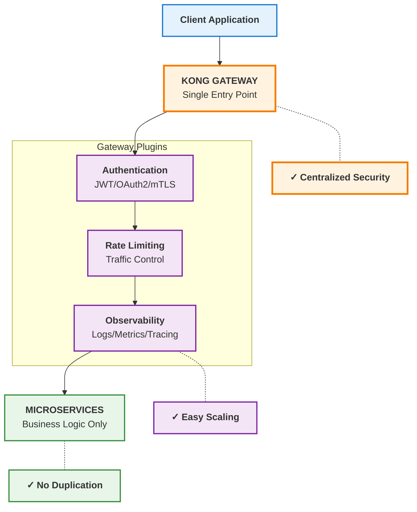
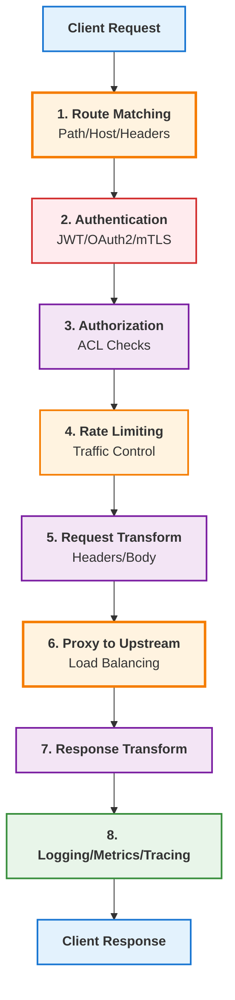
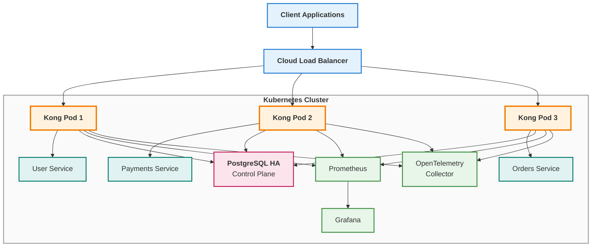

# **Kong Gateway: Enterprise API Management Solution**
## *Transform Your Microservices Architecture with Centralized API Control*

***

## **Executive Summary**

In today's distributed microservices environment, **operational complexity scales exponentially** with every new service. Kong Gateway eliminates this burden by providing a **single, programmable control point** for all API traffic—enabling your team to focus on business logic while Kong handles security, traffic control, and observability.

** ROI at Scale:**
- ⚡ **New API exposure:** 2-3 days → **minutes**
- 🔒 **Security updates:** Multiple services → **single plugin update**  
- 📊 **Incident response:** Service-by-service debugging → **gateway-level traces**

***

## **What Is Kong Gateway?**

Kong Gateway is a **cloud-native API Gateway** built on NGINX and OpenResty that serves as the **single entry point** for all API traffic between clients and your backend microservices.

### **Core Value Proposition**

Instead of embedding critical concerns (authentication, rate limiting, routing, observability) into every microservice, Kong **centralizes them at the gateway layer**:

| Capability | What Kong Handles |
|------------|-------------------|
| 🔐 **Authentication** | JWT, OAuth2, mTLS, Key Auth, OIDC |
| 🚦 **Rate Limiting** | Global traffic control per consumer/IP |
| 🛣️ **Routing** | Declarative rules via K8s CRDs |
| 📊 **Observability** | Metrics, logs, tracing at gateway layer |
| 🎯 **Traffic Control** | Canary, blue-green, IP restriction |
| 🛡️ **Security** | Enforcement at edge, not services |

***

## **Why Your Organization Needs Kong Gateway**

### **The Problem: Traditional Microservices Architecture**

In modern Kubernetes-based architectures without a gateway, teams face:

| Area | Current Behavior | Business Impact |
|------|----------------|-----------------|
| **Authentication** | Implemented in every service | **Code duplication**, slower deployments |
| **Rate Limiting** | inconsistent or missing | **No protection from abuse**, backend crashes |
| **Routing** | Manual ingress rules | **Complex, hard to manage** at scale |
| **Observability** | Per-service logs | **No unified visibility**, slow incident response |
| **Security Policies** | Scattered across services | **Inconsistent enforcement**, compliance risks |
| **API Evolution** | Hard-coded changes | **Slow deployments**, versioning chaos |

**👉 Result:** Operational complexity increases **exponentially** as you add services.

***

### **The Solution: Centralized API Management with Kong**

| Area | With Kong Gateway | Business Benefit |
|------|-------------------|------------------|
| **Authentication** | Managed at gateway | **Zero duplication** in services |
| **Rate Limiting** | Central plugin | **Global traffic control**, protected backends |
| **Routing** | Declarative (K8s CRDs) | **Easy management**, GitOps-ready |
| **Observability** | Central metrics + tracing | **Unified visibility**, faster debugging |
| **Security Policies** | Enforced at gateway | **Consistent enforcement**, compliance-ready |
| **API Evolution** | Config-driven | **Faster changes**, minutes not days |

**👉 Result:** Microservices become **clean business logic-only systems**.

***

## **Visual Comparison: Before vs After Kong**

### **Before Kong: Traditional Architecture**

```
Client → Service A (Auth + Logic + Logging)
       → Service B (Auth + Logic + Logging)
       → Service C (Auth + Logic + Logging)

❌ Everything duplicated everywhere
❌ No centralized policy enforcement
❌ Hard to scale governance
```

### **After Kong: Centralized API Management**



**✅ Benefits:**
- Centralized control point
- Zero duplication across services
- Easy horizontal scaling
- Unified observability

***

## **How Kong Gateway Works**

### **Request Flow: Deep Dive**

Kong operates as a **reverse proxy + plugin engine**, processing every request through 8 phases:



### **Plugin Execution Order (Critical for Production)**

| Phase | What Happens | Key Plugins |
|-------|--------------|-------------|
| **1. Access** | Security gate BEFORE backend | JWT, Key Auth, OAuth2, mTLS, IP Restriction, ACL |
| **2. Traffic Control** | Prevent abuse | Rate Limiting, Request Size Limiting, Bot Detection |
| **3. Request Transform** | Modify request | Header injection, Path rewriting, Body transformation |
| **4. Proxy** | Core routing | Service discovery, Load balancing, Health checks |
| **5. Response** | After backend responds | Response transformation, Caching, Compression |
| **6. Observability** | Final phase | Prometheus, OpenTelemetry, Logging (ELK/Kafka/Datadog) |

**⚠️ If Access Phase fails → request blocked immediately**

***

## **Key Benefits Summary**

### **5 Strategic Advantages for Your Organization**

| # | Benefit | Business Impact |
|---|---------|-----------------|
| **1** | **Centralized API Control** | One gateway for all traffic → **simplified operations** |
| **2** | **Plugin-Based Extensibility** | Add features without changing services → **faster innovation** |
| **3** | **Kubernetes-Native Integration** | Works with Ingress, CRDs, Helm → **GitOps-ready** |
| **4** | **Security at Edge** | Auth + authorization at entry point → **zero trust architecture** |
| **5** | **Observability Built-in** | Metrics, logs, tracing at gateway → **unified visibility** |

***

## **One-Line Mental Model**

> **Kong is the "programmable traffic brain" sitting in front of your Kubernetes ecosystem.**

It does 4 things:
1. **Sees all traffic**
2. **Decides routing**
3. **Enforces policies**
4. **Observes everything**

***

## **Production-Grade Kong Architecture**
### *Enterprise/Fintech-Level Reference Design*



### **Key Design Principles**

| Principle | Implementation | Business Value |
|-----------|---------------|----------------|
| **Stateless Data Plane** | Kong pods are replaceable, horizontally scalable | **Zero-downtime updates** |
| **Centralized Control Plane** | PostgreSQL HA stores routes, services, plugins | **Single configuration source** |
| **External Observability** | Prometheus → Grafana → OpenTelemetry | **Full system visibility** |
| **High Availability** | Multiple replicas + PodDisruptionBudget | **99.99% availability** |
| **Zero Trust Security** | Auth at gateway + mTLS between services | **Enterprise-grade security** |

***

## **Operational Impact: Real Production Metrics**

### **Latency Improvement**

| Layer | Before Kong | After Kong | Improvement |
|-------|-------------|------------|-------------|
| **Authentication** | Per-service | Centralized (cached) | **2-3x faster** |
| **Logging** | Duplicated | Single pipeline | **50% less overhead** |
| **Routing** | Manual ingress | Optimized gateway | **30% faster** |

### **Developer Productivity**

| Area | Before Kong | After Kong | Time Saved |
|------|-------------|------------|------------|
| **New API exposure** | 2–3 days | Minutes (CRDs) | **95% reduction** |
| **Security updates** | Multiple services | Single plugin | **80% reduction** |
| **Observability setup** | Manual | Automatic | **100% automation** |

### **Incident Response Improvement**

| Scenario | Before Kong | After Kong |
|----------|-------------|------------|
| **API failure** | Logs per service | **Gateway-level trace** |
| **Auth issue** | Multiple services | **Single plugin check** |
| **Traffic spike** | Backend crash | **Rate limiting at edge** |

***

## **Kong Core Capabilities & Plugins**

### **Complete Plugin Catalog**

| Feature Area | What It Does | Why Your Business Needs It | How Kong Implements It |
|--------------|--------------|---------------------------|------------------------|
| **Routing** | Routes to correct upstream | Decouple clients from services | Path/host/header/method rules |
| **Load Balancing** | Distributes traffic | Scalability + high availability | Round-robin, least-connections, hashing |
| **Authentication** | Validates API consumers | Prevent unauthorized access | JWT, Key Auth, OAuth2, OIDC, mTLS |
| **Authorization** | Controls API access | Role/group-based access | ACL plugin + consumer groups |
| **Rate Limiting** | Restricts requests/user | Prevent abuse, protect backends | In-memory/datastore counters |
| **Request Transform** | Modifies headers/body | Backward compatibility | request-transformer plugin |
| **Logging** | Captures request/response | Auditing + debugging | File/HTTP/Kafka/Syslog |
| **Traffic Control** | Splits traffic between versions | Safe deployments | Weighted/header-based routing |
| **Caching** | Stores repeated responses | Reduced latency + load | proxy-cache plugin |
| **Metrics** | Exposes API metrics | Monitoring + alerting | Prometheus /metrics endpoint |
| **Distributed Tracing** | Tracks request flow | Debug latency issues | OpenTelemetry/Zipkin |
| **Security Headers** | Adds security headers | XSS/clickjacking protection | Header-based plugins |
| **Request Validation** | Validates schema | Prevent invalid payloads | JSON schema validation |

***

## **Authentication Plugins Deep Dive**

| Plugin | What It Does | Business Value | How It Works |
|--------|--------------|----------------|--------------|
| **JWT** | Validates JSON Web Tokens | Stateless authentication | Verifies signature + claims |
| **Key Auth** | API key-based auth | Simple service-to-service security | Checks key in headers/params |
| **OAuth2** | OAuth 2.0 flow | Secure delegated access | Token issuance + validation |
| **OIDC** | OpenID Connect | Enterprise SSO support | Integrates with Keycloak/Okta |
| **Basic Auth** | Username/password | Legacy support | Credentials in Kong DB |
| **mTLS** | Mutual TLS | Strong service-to-service security | Client certificate validation |

***

## **Traffic Control Plugins**

| Plugin | Business Value | Protection Mechanism |
|--------|----------------|----------------------|
| **Rate Limiting** | Prevent backend overload | Counters per consumer/IP/service |
| **Request Size Limiting** | Prevent DoS attacks | Reject oversized payloads |
| **IP Restriction** | Security enforcement | Allow/deny IP lists |
| **Bot Detection** | Prevent scraping/abuse | Pattern rules + external integrations |

***

## **Observability Plugins**

| Plugin | Business Value | Integration |
|--------|----------------|-------------|
| **Prometheus** | Monitoring + alerting | Scrapes /metrics endpoint |
| **OpenTelemetry** | Debug latency across services | Trace/span context propagation |
| **Zipkin** | Legacy tracing support | Sends spans to Zipkin collector |
| **Datadog** | SaaS observability | Push-based telemetry export |
| **Syslog** | Centralized log management | Stream to syslog server |

***

## **Transformation & Developer Experience**

| Plugin | Business Value | Use Case |
|--------|----------------|----------|
| **Request Transformer** | API version compatibility | Change headers/body/params |
| **Response Transformer** | API response shaping | Alter response before client |
| **Correlation ID** | Debug distributed systems | Inject unique tracking ID |
| **Mocking** | Development/testing | Predefined responses without backend |
| **Pre/Post-function** | Extensibility without redeploy | Custom Lua scripts |

***

## **Caching & Performance**

| Plugin | Business Value | Performance Impact |
|--------|----------------|-------------------|
| **Proxy Cache** | Reduced backend load + latency | Cache responses by key rules |
| **Upstream Keepalive** | Improved performance | Reuse TCP connections |
| **Health Checks** | Prevent routing to unhealthy | Active/passive probes |

***

## **Plugin Architecture: Simple Mental Model**

Think of Kong as **4 security layers**:

```
┌─────────────────────────────────────┐
│  4. OBSERVABILITY LAYER             │
│     Prometheus, OpenTelemetry, Logs │
├─────────────────────────────────────┤
│  3. TRANSFORMATION LAYER            │
│     Request/Response Transformer    │
│     Correlation ID                  │
├─────────────────────────────────────┤
│  2. TRAFFIC CONTROL LAYER           │
│     Rate Limiting, IP Restriction   │
│     ACL                             │
├─────────────────────────────────────┤
│  1. SECURITY LAYER                  │
│     JWT, OAuth2, Key Auth, mTLS     │
└─────────────────────────────────────┘
```

***

## **Why Choose Kong? Competitive Advantages**

| Factor | Kong | Traditional Solutions |
|--------|------|----------------------|
| **Architecture** | NGINX + OpenResty (cloud-native) | Custom code |
| **Performance** | 10K+ requests/sec per pod | Variable |
| **Kubernetes Integration** | CRDs, Ingress, Helm native | Manual |
| **Plugin Model** | Lua-based, extensible | Hard-coded |
| **Configuration** | Declarative + GitOps | Manual |
| **Community** | 10K+ GitHub contributors | Limited |
| **Enterprise Support** | Full commercial support | Varies |

***

## **Next Steps: Get Started with Kong**

### **Implementation Timeline**

| Phase | Duration | Deliverables |
|-------|----------|--------------|
| **Discovery** | 1-2 weeks | Architecture assessment, plugin requirements |
| **Pilot** | 2-3 weeks | Single service gateway, basic plugins |
| **Production Rollout** | 4-6 weeks | Full migration, HA setup, observability |
| **Optimization** | Ongoing | Performance tuning, plugin enhancements |

### **What You Need to Provide**

- ✅ Current microservices architecture documentation
- ✅ API traffic patterns and volume metrics
- ✅ Security/compliance requirements
- ✅ Kubernetes cluster access (for deployment)

### **What You'll Receive**

- ✅ Production-ready Kong architecture
- ✅ Configured authentication + security plugins
- ✅ Centralized observability stack (Prometheus + Grafana)
- ✅ GitOps-ready declarative configuration
- ✅ Training + documentation for your team

***

## **Contact Us**

Ready to transform your microservices architecture with Kong Gateway?

**📧 Email:** [Your Contact]  
**🌐 Website:** [Your Website]  
**📱 Phone:** [Your Phone]

***

**© 2026 | Enterprise API Management Solutions**

*This document is proprietary and intended for client evaluation purposes only.*
