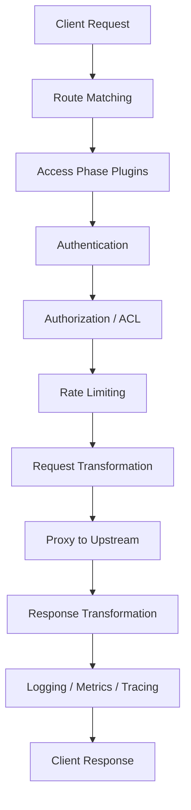
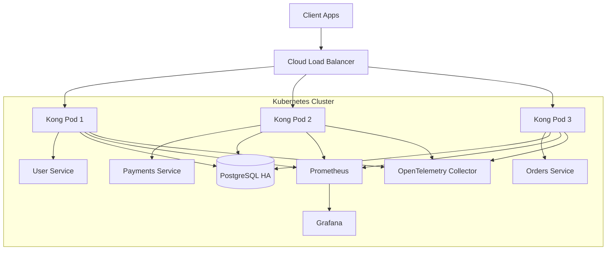

Yes — to run Kong with PostgreSQL mode, you only need to update a few specific files.

Below is the exact list of files to update and what to change.

---

# ✅ 1. UPDATE `defaults/main.yml`

Path:

```bash id="j8gnq9"
kong-setup/defaults/main.yml
```

---

## CHANGE THIS

FROM:

```yaml id="m1q8jt"
kong_mode: "dbless"
```

TO:

```yaml id="2a7p6g"
kong_mode: "postgres"
```

---

# FINAL FILE

```yaml id="trj4e7"
---
kong_version: "3.9.0"

# deployment mode
# values:
# - dbless
# - postgres
kong_mode: "postgres"

kong_admin_listen: "127.0.0.1:8001"
kong_proxy_listen: "0.0.0.0:8000"

# postgres settings
kong_pg_host: "127.0.0.1"
kong_pg_port: 5432
kong_pg_database: "kong"
kong_pg_user: "kong"
kong_pg_password: "kong"

backend_host: "127.0.0.1"
```

---

# ✅ 2. UPDATE `templates/kong.conf.j2`

Path:

```bash id="f9n0t6"
kong-setup/templates/kong.conf.j2
```

---

# FINAL FILE

```jinja id="gq7j6e"

database = postgres

pg_host = {{ kong_pg_host }}
pg_port = {{ kong_pg_port }}
pg_user = {{ kong_pg_user }}
pg_password = {{ kong_pg_password }}
pg_database = {{ kong_pg_database }}


database = off
declarative_config = /etc/kong/kong.yml


admin_listen = {{ kong_admin_listen }}
proxy_listen = {{ kong_proxy_listen }}
```

---

# ✅ 3. UPDATE `templates/kong.service.j2`

Path:

```bash id="5bb2qb"
kong-setup/templates/kong.service.j2
```

---

# FINAL FILE

```ini id="yk6rfc"
[Unit]
Description=Kong API Gateway
After=network.target

[Service]
Type=forking
ExecStart=/usr/local/bin/kong start -c /etc/kong/kong.conf
ExecStop=/usr/local/bin/kong stop -c /etc/kong/kong.conf
ExecReload=/usr/local/bin/kong reload -c /etc/kong/kong.conf
Restart=on-failure
LimitNOFILE=4096

[Install]
WantedBy=multi-user.target
```

---

# IMPORTANT

REMOVE THIS:

```ini id="8ifd0m"
After=postgresql.service
Requires=postgresql.service
```

because PostgreSQL service name changes across servers:

Examples:

```text id="wdb6y2"
postgresql.service
postgresql@14-main.service
postgresql@16-main.service
```

This caused your earlier failure.

Your new `postgres.yml` dynamically detects PostgreSQL service automatically.

---

# ✅ 4. UPDATE `tasks/postgres.yml`

Path:

```bash id="yv7lba"
kong-setup/tasks/postgres.yml
```

---

# FINAL FILE

```yaml id="4ukntt"
---
- name: Install PostgreSQL
  apt:
    name:
      - postgresql
      - postgresql-contrib
    state: present
    update_cache: yes

- name: Find PostgreSQL service name
  shell: systemctl list-units --type=service | grep postgres | awk '{print $1}' | head -n1
  register: postgres_service
  changed_when: false

- name: Start PostgreSQL service
  systemd:
    name: "{{ postgres_service.stdout }}"
    state: started
    enabled: yes
  when: postgres_service.stdout != ""

- name: Wait for PostgreSQL TCP port
  wait_for:
    host: 127.0.0.1
    port: 5432
    timeout: 120

- name: Wait for PostgreSQL fully ready
  shell: pg_isready -h 127.0.0.1 -p 5432
  register: pg_ready
  retries: 30
  delay: 3
  until: pg_ready.rc == 0
  changed_when: false

- name: Find PostgreSQL config
  find:
    paths: /etc/postgresql
    patterns: postgresql.conf
    recurse: yes
  register: pg_conf

- name: Ensure PostgreSQL listens on IPv4 only
  lineinfile:
    path: "{{ pg_conf.files[0].path }}"
    regexp: '^#?listen_addresses'
    line: "listen_addresses = '127.0.0.1'"
  when: pg_conf.matched > 0

- name: Restart PostgreSQL
  systemd:
    name: "{{ postgres_service.stdout }}"
    state: restarted
  when: postgres_service.stdout != ""

- name: Create Kong DB user
  shell: |
    sudo -u postgres psql -tc "SELECT 1 FROM pg_roles WHERE rolname='{{ kong_pg_user }}'" | grep -q 1 || \
    sudo -u postgres psql -c "CREATE USER {{ kong_pg_user }} WITH PASSWORD '{{ kong_pg_password }}';"
  args:
    executable: /bin/bash

- name: Create Kong database
  shell: |
    sudo -u postgres psql -lqt | cut -d \| -f 1 | grep -qw {{ kong_pg_database }} || \
    sudo -u postgres psql -c "CREATE DATABASE {{ kong_pg_database }} OWNER {{ kong_pg_user }};"
  args:
    executable: /bin/bash
```

---

# ✅ 5. UPDATE `tasks/service.yml`

Path:

```bash id="vduz9y"
kong-setup/tasks/service.yml
```

---

# FINAL FILE

```yaml id="rd9xv3"
---
- name: Validate Kong config
  command: kong check /etc/kong/kong.conf
  changed_when: false

- name: Stop Kong safely
  systemd:
    name: kong
    state: stopped
  ignore_errors: yes

- name: Wait for PostgreSQL stable connection
  shell: |
    PGPASSWORD={{ kong_pg_password }} psql \
    -h 127.0.0.1 \
    -U {{ kong_pg_user }} \
    -d postgres \
    -c "SELECT 1;"
  register: db_ping
  retries: 20
  delay: 3
  until: db_ping.rc == 0
  changed_when: false
  when: kong_mode == "postgres"

- name: Check Kong schema existence
  shell: sudo -u postgres psql -d {{ kong_pg_database }} -c "\dt"
  register: schema_check
  failed_when: false
  changed_when: false
  when: kong_mode == "postgres"

- name: Run migrations bootstrap (first time only)
  command: kong migrations bootstrap -c /etc/kong/kong.conf
  when:
    - kong_mode == "postgres"
    - "'kong' not in schema_check.stdout"

- name: Run migrations up
  command: kong migrations up -c /etc/kong/kong.conf
  when: kong_mode == "postgres"

- name: Run migrations finish
  command: kong migrations finish -c /etc/kong/kong.conf
  when: kong_mode == "postgres"

- name: Start Kong
  systemd:
    name: kong
    state: started
    enabled: yes
```

---

# ✅ 6. NO CHANGE REQUIRED

These files are already fine:

| File                    | Change Needed |
| ----------------------- | ------------- |
| `tasks/main.yml`        | ❌             |
| `tasks/config.yml`      | ❌             |
| `tasks/verify.yml`      | ❌             |
| `handlers/main.yml`     | ❌             |
| `templates/kong.yml.j2` | ❌             |
| `vars/main.yml`         | ❌             |
| `install.yml`           | ❌             |

---

# ✅ HOW TO RUN POSTGRES MODE

After updating files:

---

# STEP 1 → Commit

```bash id="rmrkw4"
git add .
git commit -m "Enable Kong PostgreSQL deployment mode"
git push origin kong-gateway-setup
```

---

# STEP 2 → Run Semaphore Job

Semaphore will:

1. Install PostgreSQL
2. Detect postgres service dynamically
3. Create DB/user
4. Run Kong migrations
5. Start Kong
6. Verify Admin API

---

# ✅ HOW TO VERIFY

---

## Verify PostgreSQL

```bash id="4f9xbq"
systemctl list-units --type=service | grep postgres
```

---

## Verify Kong DB Mode

```bash id="hmf6tl"
cat /etc/kong/kong.conf
```

Should show:

```ini id="mjlwmv"
database = postgres
```

---

## Verify Kong Tables

```bash id="q6o6xm"
sudo -u postgres psql -d kong -c "\dt"
```

You should see Kong schema tables.

---

# ✅ FINAL RESULT

After these updates:

| Feature                             | Status |
| ----------------------------------- | ------ |
| PostgreSQL auto-install             | ✅      |
| Dynamic postgres service detection  | ✅      |
| Automatic DB/user creation          | ✅      |
| Migration automation                | ✅      |
| Kong DB-backed mode                 | ✅      |
| No manual PostgreSQL install needed | ✅      |
| Works even if server IP changes     | ✅      |
| Semaphore compatible                | ✅      |

Great — here’s the **next-level deep dive pack** you asked for, in a **senior platform engineering style**.

---

# 1. Kong Request Lifecycle (Deep Dive + Plugin Execution Order)

This is how a request actually flows inside Kong in production.

## High-Level Flow

```text
Client → Kong → Plugin Phases → Upstream Service → Response Plugins → Client
```

---

## Detailed Execution Pipeline (Important for Interviews + Debugging)

Kong processes every request in **phases**:



---

## Plugin Execution Order (VERY IMPORTANT)

### 🔵 1. Access Phase (Security Gate)

Executed BEFORE request reaches backend.

* JWT Authentication
* Key Auth
* OAuth2 / OIDC
* mTLS validation
* IP Restriction
* ACL checks

👉 If this fails → request is blocked immediately.

---

### 🟡 2. Traffic Control Phase

Controls abuse and fairness.

* Rate Limiting
* Request Size Limiting
* Bot protection rules

---

### 🟣 3. Request Transformation Phase

Modifies request before sending upstream.

* Header injection/removal
* Path rewriting
* Query parameter modification
* Body transformation

---

### 🟢 4. Proxy Phase (Core Routing)

Kong forwards request to upstream service.

* Service discovery (Kubernetes DNS)
* Load balancing
* Health check enforcement

---

### 🔴 5. Response Phase

Executed after backend responds.

* Response transformation
* Header injection
* Caching
* Compression

---

### ⚫ 6. Logging / Observability Phase (Final)

Executed at end of lifecycle.

* Prometheus metrics
* OpenTelemetry traces
* Logging (ELK / Kafka / Datadog)
* Correlation ID injection

---

# 2. Production-Grade Kong Architecture (Fintech / Enterprise Level)

## Reference Architecture



---

## Key Design Principles

### 1. Stateless Data Plane

* Kong pods are stateless
* Horizontally scalable
* Replaceable without downtime

---

### 2. Centralized Control Plane (DB)

Stores:

* Routes
* Services
* Plugins
* Consumers

---

### 3. External Observability Stack

* Prometheus → metrics
* Grafana → visualization
* OpenTelemetry → tracing

---

### 4. High Availability Design

* Multiple Kong replicas behind LB
* PostgreSQL HA cluster
* PodDisruptionBudget enabled

---

### 5. Zero Trust Edge Security

* Auth at gateway (not services)
* mTLS between services
* ACL-based access control

---

# 3. Before vs After Kong (Deep Operational View)

## BEFORE (Traditional Microservices)

```text
Client → Service A (Auth + Logic + Logging)
       → Service B (Auth + Logic + Logging)
       → Service C (Auth + Logic + Logging)
```

### Problems:

* Authentication duplicated everywhere
* No centralized policy enforcement
* Hard to scale governance
* Debugging requires service-by-service logs
* Security inconsistencies across teams

---

## AFTER (With Kong Gateway)

```text
Client
  ↓
Kong Gateway
  ├── Authentication (JWT/OAuth/mTLS)
  ├── Rate Limiting
  ├── ACL Authorization
  ├── Observability (Logs/Metrics/Tracing)
  ↓
Microservices (clean business logic only)
```

### Benefits:

* Security enforced at one layer
* Services are simplified
* Central observability
* Faster deployments
* Easier governance

---

# 4. Operational Impact (Real Production View)

## Latency Impact

| Layer   | Before         | After                                 |
| ------- | -------------- | ------------------------------------- |
| Auth    | Per service    | Centralized (faster caching possible) |
| Logging | Duplicated     | Single pipeline                       |
| Routing | Manual ingress | Optimized gateway routing             |

---

## Dev Productivity Impact

| Area                | Before            | After                |
| ------------------- | ----------------- | -------------------- |
| New API exposure    | 2–3 days          | minutes (CRDs)       |
| Security updates    | multiple services | single plugin update |
| Observability setup | manual            | automatic            |

---

## Incident Response Improvement

| Scenario      | Before Kong       | After Kong            |
| ------------- | ----------------- | --------------------- |
| API failure   | logs per service  | gateway-level trace   |
| auth issue    | multiple services | single plugin check   |
| traffic spike | backend crash     | rate limiting at edge |

---

# 5. Mental Model (VERY IMPORTANT)

👉 Think of Kong as:

### “A programmable traffic brain sitting in front of Kubernetes”

It does 4 things:

```text
1. Sees all traffic
2. Decides routing
3. Enforces policies
4. Observes everything
```

---

# If you want next level (highly recommended)

I can also give you:

### 🔥 1. Kong vs Ingress Controller deep comparison

### 🔥 2. Real production incident debugging walkthrough

### 🔥 3. Enterprise banking-grade architecture (zero trust + multi-cluster Kong)

### 🔥 4. Interview questions + answers (very high value)

### 🔥 5. “How Kong handles 1M+ requests/sec” deep scaling design

Just tell me 👍

